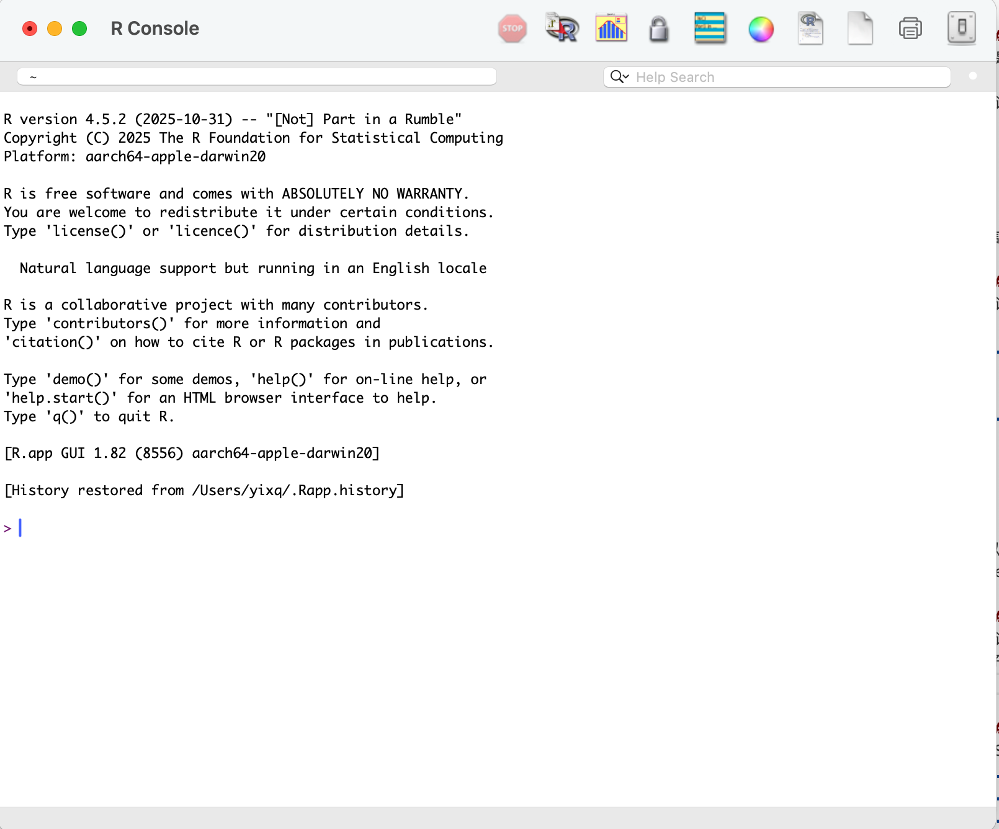
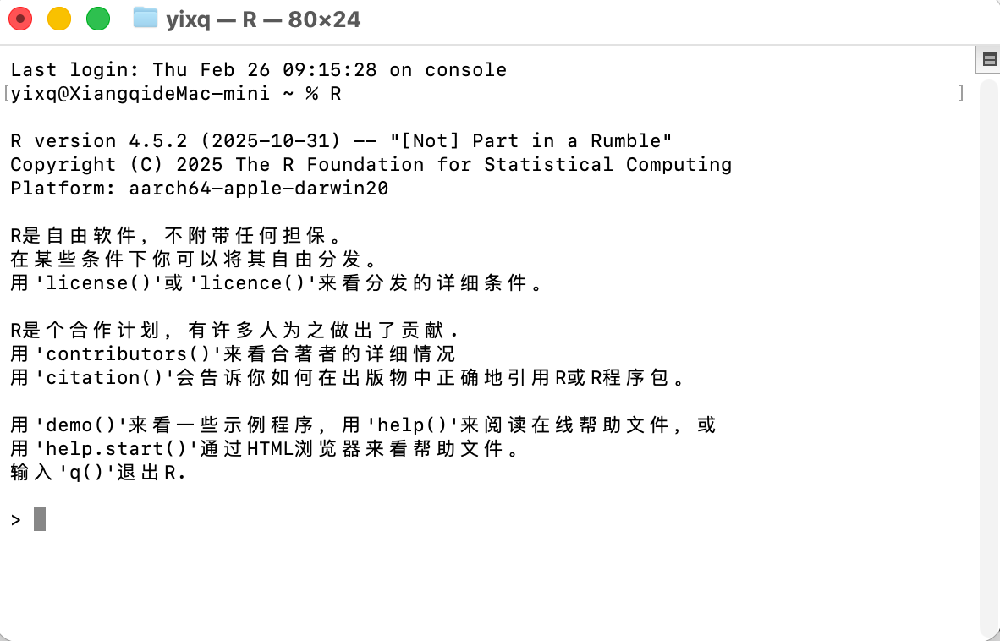

# 课程介绍

## 思考题：为什么选这门课？

::: incremental
-   研究方向
-   数据分析和编程的基础
-   期待从这门课学到什么
:::

## 主要内容

::: incremental
- `R`语言基础与`tidyverse`
- *基础统计方法的回顾*：t检验，方差分析，线性回归......
- *基础统计方法的***局限性**
    - 关键假设
    - 模型诊断
- *基础统计方法*的**拓展**
  - 广义线性模型
  - 混合效应模型
  - 广义加性模型......
:::


## 考核方式

::: incremental
平时作业和课程项目各占50%

- 平时作业
  - 提交方式：课堂派
  - 提交截止时间：星期日
  - 提交文件格式：qmd文件+html文件

- 课程项目
  - 提交方式：课堂派
  - 提交截止时间：第18周的星期日
  - 提交文件格式：qmd文件+html文件+其它文件 
:::

## 关于课程项目

选择一篇已发表的学术论文，重现其中的数据分析过程，并撰写一篇报告。报告内容包括：

-   论文的简介
-   论文数据来源 
-   数据的预处理、统计分析和可视化 
-   对原文所用方法的评价和改进建议 
-   *可选部分：使用你认为更合理的方法进行分析，并比较结果* 

## 关于课程项目
评分标准：  

-   所选论文的质量和分析方法的难度（20%）
-   数据分析的正确性和完整性（40%）
-   报告的清晰度和逻辑性（30%）
-   创新性（10%）

> 关于AI的使用：可以使用AI工具辅助数据分析和报告撰写，但必须在报告中明确说明使用了哪些AI工具，以及它们在分析中的具体作用。评分时会考虑AI工具的合理使用和对分析结果的贡献。

## 作业1：
为什么选这门课？

-   研究方向
-   数据分析和编程的基础
-   期待从这门课学到什么


##

:::: {.columns}

::: {.column width="60%"}
<span style="font-family: 'Georgia', 'Times New Roman', serif; font-size: 5rem;">
“Young man, in mathematics, you don't understand things. You just get used to them.”
</span>
:::

::: {.column width="40%"}


<div style="text-align:center">John von Neumann (1903–1957)</div>
:::

::::

# R语言基础

## R语言是什么？
R是一种主要用于**统计分析**和**数据可视化**的编程语言。

R语言的特点：

-   **免费，开源，全平台**，拥有庞大的社区支持。
-   **专为统计分析设计**：提供了丰富的统计方法和工具，适合各种数据分析任务。
-   **优秀的可视化功能**：如`ggplot2`等包提供了强大的数据可视化工具。
-   **丰富的包**：有成千上万的包，涵盖各种工具，例如，机器学习、深度学习、生物信息学等领域。

## R语言的安装
R语言的安装通常包括R本身和一个集成开发环境（IDE）,推荐使用`RStudio`作为IDE。

1. 安装R语言：访问[R项目官网](https://www.r-project.org/){target="_blank" rel="noopener noreferrer"}下载并安装。
2. 安装RStudio：访问[RStudio官网](https://posit.co/download/rstudio-desktop/){target="_blank" rel="noopener noreferrer"}下载并安装RStudio Desktop版本。
3. *（可选）安装Rig管理不同版本的R，访问[Rig官网](https://github.com/r-lib/rig){target="_blank" rel="noopener noreferrer"}下载并安装。*

> Positron是Posit公司全新推出的IDE，如果你熟悉vs code，想要更好的AI支持，可以考虑安装[Positron](https://positron.posit.co){target="_blank" rel="noopener noreferrer"}。

## R自带的GUI
`R`语言安装完成后，会有一个自带的图形交互界面（GUI）:

::: {.r-stack}
{.fragment width=800px}
:::

## 命令行中使用R
在命令行中输入`R`命令可以进入R的交互式环境：

::: {.r-stack}
{.fragment width=800px}
:::


## RStudio界面介绍
RStudio界面主要分为四个部分：

1. **控制台**：用于直接输入R命令并查看输出结果。
2. **源代码编辑器**：用于编写和编辑R脚本、R Markdown文档等。
3. **环境/历史**：显示当前工作环境中的对象和历史命令。
4. **文件/图形/包/帮助**：用于管理文件、查看图形输出、安装和加载包，以及查看帮助文档。

## 作业2
R和Rstudio（或Positron）的安装

## 对象
**对象**（object）：在R中，对象是数据的载体，可以是数值、字符、逻辑值、函数等。

> "Everything that exists in R is an object." --- John McKinley Chambers

```{r}
#| echo: true
x <- 10
x
y = 20
y
```
> 虽然`<-`和`=`都可以用于赋值，推荐使用`<-`。

## 对象命名规则

-   以字母或点（.）开头，后续可以包含字母、数字、点（.）或下划线（_）。
-   区分大小写，例如`myVar`和`myvar`是两个不同的对象。
-   避免使用R的保留字（如`if`、`else`、`for`等）对象名。
-   应具有描述性，便于理解其用途，例如`age`、`height`等。
-   使用下划线（_）或驼峰命名法（如`male_age`、`myVariable`）提高可读性.

> R允许使用一些特殊字符（如空格、连字符等）来创建对象名，需用反引号（``）将其括起来。


## 向量 {auto-animate="true"}
**向量**(vector)是R最基础（可能也是最重要）的数据类型，分两类：

-   **原子型向量**（atomic vector），由同一类型的元素组成
-   **列表**（list），可以包含不同类型的元素。

## 原子型向量 {auto-animate="true"}
**向量**(vector)是R最基础（可能也是最重要）的数据类型，分两类：

-   <span style="color:#8B0000">**原子型向量（atomic vector），由同一类型的元素组成**</span>
-   **列表**（list），可以包含不同类型的元素。

函数**`c()`**构造原子型向量，将多个元素组合成一个向量：
```{r}
#| echo: true
die <- c(1,2,3,4,5,6)
five <- 5 # 单个数值也是一个长度为1的原子型向量
```

六种基本的原子型向量：**双整型**（double）、**整数型（integer）**、**字符型**（character）、**逻辑型**（logical）、复数型（complex）和原生型（raw）。

## 双整型向量
双整型向量用来存储普通的数值型数据，R中键入的任何一个数值都会默认以双整型存储。
```{r}
#| echo: true
# 创建一个数值向量,其中包含整数、浮点数、科学计数法和十六进制数
num_v <- c(1, 2.3, -3, -100.4, 1.23e4, 0xcafe)
num_v
typeof(num_v) # 查看num_v的类型
```

> 双整型有3个特殊值：`Inf`，`-Inf`和`NnN`(not a number)。

>探索：**双整型（double）**名称的由来是什么？

## 整数型向量
整数型向量用来存储整数数据，在R中通过在数值后面添加`L`来创建一个整数型向量。
```{r}
#| echo: true
int_v <- c(1L, 1234L, 1e4L, 0xcafeL) # 创建一个整数向量
int_v
typeof(int_v) # 查看int_v的类型
```

> 探索：  
1. `sqrt(2)^2-2`的结果是什么？为什么？  
2. 整数型相较于双整型有哪些优缺点？整数型的应用场景有哪些？

## 字符型向量
字符型向量用来存储文本数据:
```{r}
#| echo: true
text <- c("Hello", "World", "!", "2026") # 创建一个字符向量
text
typeof(text) # 查看char_v的类型
```
字符型向量中的每个元素称作一个字符串（string），可以是单词、句子或任何文本，用一对引号包围。


>注意避免将字符串和R对象混淆，下例中`x`是一个字符型向量，长度为1，储存的值是字符串`"x"`。
```{r}
#| echo: true
x <- "x"
```

## 逻辑型向量
逻辑型向量存储布尔值（Boolean values），`TRUE`和`FALSE`:
```{r}
#| echo: true
log_v <- c(TRUE, FALSE, T, F) # 创建一个逻辑向量
log_v
typeof(log_v) # 查看log_v的类型
```
比较算符（`==`、`!=`、`>`、`<`等）和逻辑算符（`&`、`|`、`!`等）
```{r}
#| echo: true
10 > 5
c(FALSE, FALSE, TRUE) & c(FALSE, TRUE, TRUE) 
c(TRUE, TRUE, FALSE) | c(FALSE, TRUE, FALSE)
!c(TRUE, FALSE, TRUE)
``` 

## 缺失值（`NA`）
`NA`表示表示数据缺失或不可用。**大多数涉及缺失值的计算都会返回另一个缺失值。**

```{r}
#| echo: true
c(NA > 5, 10 * NA, !NA)
```
但也有一些例外：
```{r}
#| echo: true
c(NA^0, NA | TRUE, NA & FALSE)
```

`is.na()`函数可以用来检查向量中的缺失值：
```{r}
#| echo: true
vec <- c(1, NA, 3, NA, 5)
is.na(vec) # 返回一个逻辑向量，指示哪些元素是NA
```

## 类型检验 {auto-animate="true"}
`is.*()`系列函数检验一个对象是否属于某种类型：
```{r}
#| echo: true
#| eval: false
is.double(c(1, 2, 3.4))
is.integer(c(1, 2, 3))
is.character(c("1", "2", "3"))
is.logical(c("TRUE", "FALSE", "TRUE"))
```

## 类型检验 {auto-animate="true"}
`is.*()`系列函数检验一个对象是否属于某种类型：
```{r}
#| echo: true
is.double(c(1, 2, 3.4))
is.integer(c(1, 2, 3))
is.character(c("1", "2", "3"))
is.logical(c("TRUE", "FALSE", "TRUE"))
```

## 类型转换 {auto-animate="true"}
原子向量的所有元素必须为同一类型，当你组合不同类型的元素时，它们会按照固定的规则进行类型转换：
```{r}
#| echo: true
#| eval: false
typeof(c("a", 1))
```

## 类型转换 {auto-animate="true"}
原子向量的所有元素必须为同一类型，当你组合不同类型的元素时，它们会按照固定的规则进行类型转换：
```{r}
#| echo: true
#| eval: false
typeof(c("a", 1))
```

```{r}
typeof(c("a", 1))
```

## 类型转换 {auto-animate="true"}
原子向量的所有元素必须为同一类型，当你组合不同类型的元素时，它们会按照固定的规则进行类型转换：
```{r}
#| echo: true
typeof(c("a", 1))
```

```{r}
#| echo: true
#| eval: false
typeof(c(3.1, 1L))
```

## 类型转换 {auto-animate="true"}
原子向量的所有元素必须为同一类型，当你组合不同类型的元素时，它们会按照固定的规则进行类型转换：
```{r}
#| echo: true
typeof(c("a", 1))
typeof(c(3.1, 1L))
```

## 类型转换 {auto-animate="true"}
原子向量的所有元素必须为同一类型，当你组合不同类型的元素时，它们会按照固定的规则进行类型转换：
```{r}
#| echo: true
typeof(c("a", 1))
typeof(c(3.1, 1L))
```
```{r}
#| echo: true
#| eval: false
typeof(c(TRUE, 3L))
```

## 类型转换 {auto-animate="true"}
原子向量的所有元素必须为同一类型，当你组合不同类型的元素时，它们会按照固定的规则进行类型转换：
```{r}
#| echo: true
typeof(c("a", 1))
typeof(c(3.1, 1L))
typeof(c(TRUE, 3L))
```

## 类型转换 {auto-animate="true"}
原子向量的所有元素必须为同一类型，当你组合不同类型的元素时，它们会按照固定的规则进行类型转换：
```{r}
#| echo: true
typeof(c("a", 1))
typeof(c(3.1, 1L))
typeof(c(TRUE, 3L))
```

> 组合不同类型的元素，按照如下次序转换：
`character <- double <- integer <- logical`

## 类型转换 {auto-animate="true"}
类型转换常自行发生，如数学计算函数会自动转换为`double`:

```{r}
#| echo: true
x <- c(FALSE, FALSE, TRUE)

# 向量中TRUE的数量
sum(x)

# 向量中TRUE的占比
mean(x)

```

可使用`as.*()`函数（如`as.character()`, `as.double()`, `as.integer()`, `as.logical()`）来专门进行类型转换

```{r}
#| echo: true
as.integer(c("1", "1.5", "a"))
```

## 属性
通过给原子型向量赋予额外的**属性（attribute）**，可以拓展出新的数据类型，例如赋予**维度（`dim`）**形成矩阵（matrix）或数组(array):

```{r}
#| echo: true
vec <- 1:24; vec
attributes(vec) # 获取vec的属性
attr(vec, "dim") <- c(4, 6); vec
attributes(vec)
```

## 矩阵
**矩阵**（matrix）是二维数组，元素类型相同。可用`matrix()`创建矩阵。
```{r}
#| echo: true
m <- matrix(1:6, nrow = 2, ncol = 3) # 创建一个2行3列的矩阵
m
```
> 默认按照列优先（column-major order）填充矩阵。

设置`byrow = TRUE`，按行优先（row-major order）填充：
```{r}
#| echo: true
m_byrow <- matrix(1:6, nrow = 2, byrow = TRUE) # 按行优先填充矩阵
m_byrow
```

## 数组
`array`函数创建n纬数组，第一个参数是一个向量，`dim`参数指定了数组的维度。
```{r}
#| echo: true
ar <- array(c(11:14, 21:24, 31:34), dim = c(2, 2, 3)) # 创建一个2x2x3的数组
attributes(ar)
ar
```


## 向量、矩阵和数组之间的联系
三者皆储存同类型数据，矩阵和数组比向量多了维度**属性**（attribute）。
```{r}
#| echo: true
vec <- 1:6; mat <- matrix(1:6, nrow = 2); arr <- array(1:6, dim = c(2, 3))
attributes(vec) # 向量没有属性
attributes(mat) # 矩阵有dim属性
attributes(arr) # 数组有dim属性
c(typeof(vec), typeof(mat), typeof(arr)) # 元素类型都是整型

```

## 属性`names`
通过`names`属性给每一个元素增加一个名字：

```{r}
#| echo: true
vec <- 1:3
names(vec) <- c("a", "b", "c")
vec
vec <- setNames(1:3, c("A", "B", "C"))
vec
vec <- c(Aa = 1, Bb = 2, Cc = 3)
vec
```

可以通过`vec <- unname(vec)`或者`names(vec) <- NULL`去掉`names`

## S3原子向量

-   向量最重要的属性之一是**类（class）**，这是S3对象系统的基础。
-   **类（class）**使一个**对象**变成**S3对象**
-   这意味着当它被传递给**通用函数**（generic fucntion）时，会有不同表现。
-   每个S3对象都构建在基础类型之上，且通常会在其它属性中存储额外信息。

## 因子

-   **因子**（factor）只能包含预定义值。
-   用于存储分类数据, 比如性别、血型、教育水平等
-   有两个属性，`class`和`levels`
-   `class`的值为`factor`, `levels`是预定义值的字符型向量

可以使用`factor()`函数创建因子。
```{r}
#| echo: true
name <- c("Alice", "Bob", "Charlie", "David")
gender <- factor(c("Male", "Female", "Female", "Male")) # 创建一个因子
gender
```


## 因子
向`factor`函数传递一个原子型向量以生成因子，向量中的值会重新编码为一串整数值储存为一个整数型。
```{r}
#| echo: true
typeof(gender)
```

`gender`的**类**（class）：
```{r}
#| echo: true
class(gender) # 查看gender因子的类
```

`gender`的**水平**（levels）
```{r}
#| echo: true
levels(gender) # 查看gender因子的水平
```

> 探索：**因子和字符型向量有什么区别？**

## 有序因子
**有序因子（ordered factor）**是一种因子的变体。它们的行为与常规因子相似，但水平的顺序是有意义的（低、中、高）。

```{r}
#| echo: true
grade <- ordered(c("b", "b", "a", "c"), levels = c("c", "b", "a"))
grade
```

> 某些建模和可视化功能会自动利用有序因子水平顺序的特性

## 向量 {auto-animate="true"}
**向量**是R最基础（可能也是最重要）的数据类型，分：

-   **原子型向量**（atomic vector），由同一类型的元素组成
-   **列表**（list），可以包含不同类型的元素。

## 列表 {auto-animate="true"}
**向量**是R最基础（可能也是最重要）的数据类型，分：

-   **原子型向量**（atomic vector），由同一类型的元素组成
-   <span style="color:#8B0000">**列表（list），可以包含不同类型的元素。**</span>

## 列表 {auto-animate="true"}
使用`list()`函数创建列表。

```{r}
#| echo: true
l1 <- list(
  1:3, 
  "a", 
  c(TRUE, FALSE, TRUE)
)
l1
typeof(l1)
```

## 列表 {auto-animate="true"}
**命名列表（named list）**：
```{r}
#| echo: true
my_list <-
  list(name = c("Alice", "Bob", "Charlie"), scores = c(85, 90, 
  95), age = 30)
my_list
typeof(my_list)
```

## 数据框
-   数据分析中最常用的数据结构,表格数据

使用`data.frame()`函数创建数据框。
```{r}
#| echo: true
df <- data.frame(
  name = c("Alice", "Bob", "Charlie"),
  age = c(30, 25, 35),
  gender = factor(c("Female", "Male", "Male"))
)
df
```

## 数据框
-   基于命名列表的S3向量, 属性`names`,`row.names`和`class`

```{r}
#| echo: true
typeof(df)
attributes(df)

```

## 数据框
-   基于命名列表的S3向量, 属性`names`,`row.names`和`class`
```{r}
#| echo: true

names(df)
colnames(df) # 列名
rownames(df) # 行名
nrow(df) # 行数
ncol(df) # 列数
```

## 数据框
> 探索：  
1. 数据框和矩阵有什么区别和联系？  
2. 数据框和列表有什么区别和联系？  

## 向量元素选取
`[]`的使用
```{r}
#| echo: true
vec <- c(10, 20, 30, 40, 50)
vec[1] # 位置索引，选取第一个元素
vec[c(2, 4)] # 位置索引，选取第二和第四个元素
vec[c(1,1)] # 位置索引，选取第一个元素两次

```
`[]`中可以是负数，表示排除对应位置的元素：
```{r}
#| echo: true
vec[-1] # 排除第一个元素
vec[-c(2, 4)] # 排除第二和第四个元素
```

## 向量元素选取

`[]`中可以是逻辑向量
```{r}
#| echo: true
vec
vec[vec > 25] # 大于25的值
vec > 25
```

`[]`中可以是空值，可以是0

```{r}
#| echo: true
vec[]
vec[0]
```

## 向量元素选取
命名向量可以用元素名来选取特定元素
```{r}
#| echo: true
vec_named <- setNames(vec, letters[1:5])
vec_named[c("d", "c", "a")]
vec_named[c("a", "a", "a")]
```

## 列表元素选取
`[]`在列表中的使用方法同上述相同，**总返回一个列表**：

```{r}
#| echo: true
my_list
my_list[1:2]
my_list[1]
```

## 矩阵元素选取
`[]`在矩阵（和数组）中最常见的使用方式是其在向量中使用方式的简单推广：为每个维度提供一个一维索引，用逗号分隔。
```{r}
#| echo: true
m <- matrix(1:10, nrow = 2)
m
m[1, 2] # 选取第一行第二列的元素
m[, c(3, 5)] # 选取第三、五列的所有元素
m[-1, c(1, 4)] # 排除第一行，选取第一、四列的元素
```

## 矩阵元素选取{auto-animate="true"}
只提供一个一维索引将，忽律矩阵的维度，当作一个普通向量：

```{r}
#| echo: true
m
```

```{r}
#| echo: true
#| eval: false
m[c(9,3,4,7)]
```

## 矩阵元素选取{auto-animate="true"}
只提供一个一维索引，将忽略矩阵的维度，当作一个普通向量：

```{r}
#| echo: true
m
m[c(9,3,4,7)]
```

## 数据框的元素选取
-   当使用单个索引进行选取时，它们的行为类似于列表。
-   当使用两个索引进行选取时，它们的行为类似于矩阵。
```{r}
#| echo: true
df
df[c(1,3)]
df[c("age", "name") ]
```
## 数据框的元素选取
-   当使用单个索引进行选取时，它们的行为类似于列表。
-   当使用两个索引进行选取时，它们的行为类似于矩阵。
```{r}
#| echo: true
df
df[1, ] # 选取第一行
df[, "age"] # 选取age列
```

## `[[]]`和`$`
对于列表，`[[]]`用来选取单个元素，而`x$y`是`x[["y"]]`的简写

```{r}
#| echo: true
df
df[["gender"]]
df$gender # 选取gender列
df[df$age > 30, ] # 选取age大于30的行
```


## `[[]]`和`[]`的区别{auto-animate="true"}

- `[]`返回列表，即使只选一个元素，结果仍是一个列表。
- `[[]]`返回元素本身，即该元素的值。

```{r}
#| echo: true
x <- list(1:3, "a", 4:6)
```


## `[[]]`和`[]`的区别{auto-animate="true"}

- `[]`返回列表，即使只选一个元素，结果仍是一个列表。
- `[[]]`返回元素本身，即该元素的值。

```{r}
#| echo: true
x[1]
x[[1]]
```


## 脚本和quarto文档
R脚本是纯文本文件，通常以`.R`为扩展名，用于编写和保存R代码。

quarto文档是一个包含文本、代码和输出的文件，通常以`.qmd`为扩展名，用于创建动态报告和演示文稿。

## 参考资料

-   [Advanced R](https://adv-r.hadley.nz/subsetting.html), Hadley Wickham
-   R语言入门与实践（Hands-On Programming with R）, Garrett Grolemund著，人民邮电出版社，2016年
-   [quarto官方文档](https://quarto.org)

