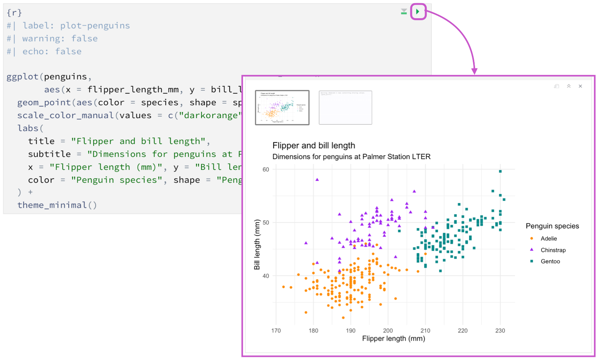

## 作业目标

本次作业对应第二讲 `talk02.qmd`，目标是：

1. 掌握 Quarto 的基本使用方法，能够在 **RStudio** 中使用 Quarto 完成作业。
2. 巩固 R 函数基础（参数、默认值、作用域）。
3. 采用“**复习 + 探索**”方式初步掌握 `ggplot2` 与 `dplyr` 的使用。

预计完成时间：**3–4 小时**。

---

## 提交要求（必须遵守）

1. 提交两个文件：
   - `homework02.qmd`
   - `homework02.html`
2. 所有代码必须可运行，渲染后 HTML 不报错。
3. 本次作业固定使用以下两个数据集：
   - `palmerpenguins::penguins`
   - `nycflights13::flights`
4. 文末必须包含 **AI 使用声明**（按文末模板填写；未使用也要填写）。

---

## Quarto基础
Quarto 是一个支持多语言的文档编写工具，`.qmd` 文件是其核心格式，可以包含文本、代码和输出结果，编写完成后可以渲染（render）成 HTML、PDF、MS Word 等多种格式。

`.qmd`文件包括3个主要部分：YAML header、Markdown文本和代码块（code chunk）。

:::callout-note
Rstudio 已经内置了 Quarto 支持，无需额外安装。
:::

### YAML header

YAML header 位于 `.qmd` 文件最顶部，由两行 `---` 包裹，用于设置文档的元信息（如标题、作者、日期）和全局选项（如输出格式、目录等）。
以下是一个简单的 YAML header 示例：

```yaml
---
title: "示例标题"
author: "你的姓名"
format: html
---
```
渲染之后，`title`的内容（也就是“示例标题”）会显示在 HTML 页面顶部，`author`会显示在标题下方，`format` 指定了输出格式为 HTML。


::: callout-note
更多关于`YAML header`的用法可以参考官方文档：[Tutorial: Authoring
](https://quarto.org/docs/get-started/authoring/rstudio.html)。
:::

### Markdown
Markdown 是一种轻量级标记语言，用于编写格式化文本，包括分级标题、列表、超链接、嵌入图片等。
常用语法：

- 分级标题：`#`、`##`、`###`
- 无序列表：行首加 `-`
- 有序列表：行首加 `1.`、`2.`
- 行内代码：反引号包裹，例如 ``mutate()``

示例：

**Markdown 源码：**

```markdown
## 数据分析
### 数据准备

- 读取数据
- 清洗变量

1. 先筛选：筛选通常使用函数如 `filter()` 来选择满足特定条件的行。
2. 再汇总
```

**渲染效果：**

::: {style="border: 1px solid #ccc; padding: 1em; border-radius: 5px;"}

## 数据分析 {.unnumbered .unlisted}
### 数据准备 {.unnumbered .unlisted}

- 读取数据
- 清洗变量

1. 先筛选：筛选通常使用函数如 `filter()` 来选择满足特定条件的行。
2. 再汇总
:::

::: callout-note
更多关于`markdown`的基础用法可以参考官方教程：[Markdown Basics
](https://quarto.org/docs/authoring/markdown-basics.html)。
:::


### 代码块（code chunk）
在`.qmd`文件，R代码块如下：
```{{r}}
x <- 1:10
mean(x)
```
可以通过设置一些选项来控制代码块在最终渲染成的文件中的行为，例如：

- `echo`: 是否显示代码
```{{r}}
#| echo: true
x <- 1:10
mean(x)
``` 
- `eval`: 是否执行代码
```{{r}}
#| eval: false
x <- 1:10
mean(x)

```
- `warning`: 是否显示警告信息
```{{r}}
#| warning: false
x <- 1:10
mean(x)
``` 
::: callout-note
更多关于代码块选项的说明可以参考官方文档：[Execution Options
](https://quarto.org/docs/computations/execution-options.html)。
:::

### 在RStudio渲染（render）

在 RStudio 中：

- 运行当前代码块：点击 chunk 右上角绿色三角。


- 渲染整个文档：点击 **Render** 按钮。


- 渲染成功后生成同名 `.html` 文件。


::: callout-note
Quarto 基础用法可以参考官方教程：[Get Started
](https://quarto.org/docs/get-started/)。
:::

::: callout-note
Quarto 进阶用法可以参考官方手册：[guide
](https://quarto.org/docs/guide/)。
:::

---

## 模块 A：函数基础（20 分）

### A1. 温度转换函数（10 分）

编写函数 `f_to_c()`，将华氏温度转换为摄氏温度。

要求：

- 输入参数名为 `f`
- 返回摄氏温度数值
- 用 3 个不同输入测试函数
- 输出保留 1 位小数

### A2. 默认参数与缺失值（6 分）

编写函数 `my_center()`，实现数值型向量的“均值中心化”：

- 参数至少包含：`x`, `na_rm = FALSE`
- 返回：`x - mean(x, na.rm = na_rm)`
- 用一个包含缺失值的向量测试

### A3. 作用域说明（4 分）

用一个简短示例说明“函数内局部变量不会污染全局环境”，并用 2–3 句话解释结果。

---

## 模块 B：`ggplot2`（复习 + 探索，30 分）
```{r}
#| echo: false
library(tidyverse)
library(palmerpenguins)
library(nycflights13)
library(ggthemes)
```

---

使用 `palmerpenguins`包中的`penguins`数据集。

### B1. 复习任务（18 分）

复现下图：
```{r}
#| echo: false
ggplot(
  data = penguins,
  mapping = aes(x = body_mass_g/1000, y = flipper_length_mm/10)
) +
  geom_point(aes(color = island, shape = island)) +
  geom_smooth(method = "lm") +
  labs(
    title = "Flipper length and body mass",
    subtitle = "Dimensions for penguins from three islands",
    x = "Body mass (kg)",
    y = "Flipper length (cm)",
    color = "Island",
    shape = "Island"
  ) +
  scale_color_colorblind() # 使用色盲友好调色板，来自ggthemes包
```


**提示：**

- 参考第二讲 `talk02.qmd` 中的代码。 
- 注意x轴和y轴的单位。

### B2. 探索任务（二选一，12 分）

从下面两题中选 **1** 题完成：

1. **分面图**：了解`facet_wrap()`函数，复现下图，并回答以下问题：

- 为什么存在一个子图为`NA`?
- 可以如何解决？

```{r}
#| echo: false
ggplot(
  data = penguins,
  mapping = aes(x = body_mass_g/1000, y = flipper_length_mm/10)
) +
  geom_point(aes(color = island, shape = island)) +
  geom_smooth(method = "lm") +
  facet_wrap(~sex, nrow = 2) +
  labs(
    title = "Flipper length and body mass",
    subtitle = "Dimensions for penguins from three islands",
    x = "Body mass (kg)",
    y = "Flipper length (cm)",
    color = "Island",
    shape = "Island"
  ) +
  scale_color_colorblind() # 使用色盲友好调色板，来自ggthemes包
```


2. **箱型图**：了解`geom_boxplot()`函数，复现下图，并回答以下问题：

- 箱型图中的“箱体”、“须”、“离群点”分别代表什么含义？
- `Biscoe`岛上的企鹅体重分布与其他两个岛相比有什么不同？可能的原因是什么？

```{r}
#| echo: false
ggplot(
  data = penguins,
  mapping = aes(x = island, y = body_mass_g/1000)
) +
  geom_boxplot(aes(fill = island)) +
  labs(
    title = "Body mass distribution by island",
    subtitle = "Body mass (kg) for penguins from three islands",
    x = "",
    y = "Body mass (kg)",
    fill = "Island"
  )
```

---

## 模块 C：`dplyr`（复习 + 探索，30 分）

使用`nycflights13`包中的`flights` 数据集。

### C1. 复习任务（18 分）

构建对象 `delay_tbl`，完成：

1. 筛选: `arr_delay > 20` 且 `dep_delay > 20`。
2. 保留列：`month`, `day`, `carrier`, `flight`, `dep_delay`, `arr_delay`, `distance`, `air_time`。
3. 新增变量：
   - `gain = dep_delay - arr_delay`
   - `speed = distance / air_time * 60`
4. 筛选 `air_time` 非缺失`NA`的行（提示：`is.na()`）。

### C2. 探索任务（二选一，12 分）

从下面两题中选 **1** 题完成：

1. 不同季节航班延误情况
   - 了解 `case_when()`，新增列"季节"，
   - 统计各季节的航班数量，以及到达延误时间的中位数和平均数。

2. 不同航程航班的延误情况
   - 了解 `if_else()`，新增列"是否长途航班"，定义为：`distance > 872`。
   - 统计长途航班和非长途航班的数量，以及到达延误时间的中位数和平均数。

## 模块 D：文档表达与规范（20 分）

1. 文档结构清晰：有分节标题、列表、必要文字说明。
2. 代码与结果对应，可复现。
3. 每个模块有结论文字，而不只给代码。
4. `qmd` 成功渲染出 `html`。

---

## Bonus（可选，加分 +10）

### Bonus 1：ggplot2（+10）
了解ggplot2的绘图主题，复现下图：

```{r}
#| echo: false
ggplot(
  data = penguins,
  mapping = aes(x = body_mass_g/1000, y = flipper_length_mm/10)
) +
  geom_point(aes(color = island, shape = island)) +
  geom_smooth(method = "lm") +
  labs(
    title = "Flipper length and body mass",
    subtitle = "Dimensions for penguins from three islands",
    x = "Body mass (kg)",
    y = "Flipper length (cm)",
    color = "Island",
    shape = "Island"
  ) +
  scale_color_colorblind() + # 使用色盲友好调色板，来自ggthemes包
  theme_bw() +
  theme(
   legend.position = "inside",
   legend.position.inside = c(0.1, 0.8),
   legend.background = element_rect(fill = "transparent", color = "black", linewidth = 0.25)
  )
```

---

## 评分标准（总分 100 + Bonus 10）

- 模块 A（函数基础）：20 分
- 模块 B（ggplot2 复习+探索）：30 分
- 模块 C（dplyr 复习+探索）：30 分
- 模块 D（文档表达与规范）：20 分
- Bonus：最多 +10 分

---

## 提交前检查清单

- [ ] `homework02.qmd` 能独立渲染成功
- [ ] `homework02.html` 已生成且内容完整
- [ ] 仅使用了固定数据集 `penguins` 和 `flights`
- [ ] 已完成 AI 使用声明（按模板填写）

---

## AI 使用声明（必填模板）

请在文末保留并填写以下模板（未使用也要填写）。

### 情况 1：我使用了 AI 工具

- 工具名称：
- 具体使用环节（如：报错排查 / 语法查询 / 代码草稿）：
- 我做的人工核查与修改：
- 我确认并对最终提交内容负责：是

### 情况 2：我未使用 AI 工具

- 本次作业未使用任何 AI 工具。
- 我确认并对最终提交内容负责：是
