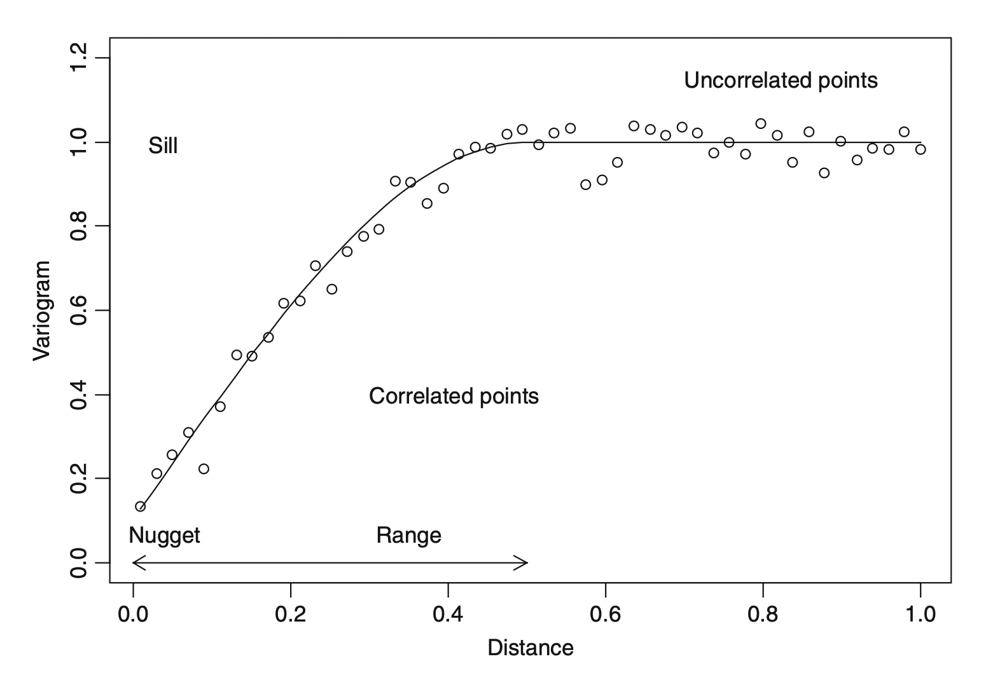

## 你将学到

::: incremental
- 回顾线性回归的基本假设
- 了解自相关的基本概念及其对回归分析的影响
- 时间自相关诊断与应对
- 空间自相关诊断与应对
:::

# 回顾：线性回归的基本假设
##

线性回归模型的基本假设包括：

::: incremental
1. 线性关系：响应变量与解释变量之间存在线性关系。
2. 独立性：观测值之间相互独立。
3. 同方差性：误差项的方差在所有水平上是相同的。
4. 正态性：误差项服从正态分布。
5. *无多重共线性(多元线性回归)：解释变量之间不存在高度相关性。*
:::

# 误差项间的相关性

## 一元线性回归：独立与同方差性假设 {.scrollable}
$$
y_i = \beta_0 + \beta_1 x_{i}+ \varepsilon_i\qquad i=1,\dots,n
$$ 
 
对于误差项$\varepsilon_i$，通常假设为独立同分布的随机变量，满足：
$$
E(\varepsilon_i) = 0 \\ 
Cov(\varepsilon_i,\varepsilon_j) = \begin{cases}
  \sigma^2, & i = j \\
  0, & i \neq j
\end{cases} \qquad i, j = 1, \dots, n
$$

这个假定常称为高斯-马尔可夫假定（Gauss-Markov assumptions）。

但实际问题中，可能存在：
$$
Cov(\varepsilon_i,\varepsilon_j) \neq 0, \quad  \exists i \neq j
$$

即存误差项之间存在相关性。

## 带来的问题
当线性模型的随机误差项存在相关性时，若仍直接用OLS做参数估计，可能会导致：

::: incremental 
- OLS估计量仍然是无偏的，但不再是最优的（不再是BLUE）。
- 均方误差（MSE）可能严重低估误差项的方差。
- t检验和F检验的结果不可靠，可能出现过度拒绝原假设的情况（即增加第一类错误率）。
- OLS估计量对抽样波动非常敏感，即在任一特定样本中，$\hat{\beta}$ 可能偏离真实值较远。
:::

## 自相关产生的原因
- 遗漏关键变量
- 模型设定错误（如遗漏非线性关系）
- 遗漏滞后项（时间序列）
。。。

> 探索：自相关产生的原因

# 时间自相关诊断与应对

## `Hawaii`数据集（节选）{.scrollable}
`Hawaii`[^1]：夏威夷群岛的降雨量和海鸟数量[^2]的逐年数据：

[^1]: 数据来源：Zuur et al., Mixed Effects Models and Extensions in Ecology with R, 2009.

[^2]: 海鸟数量取平方根，以满足误差项的同方差性假设，便于专注于自相关问题。

```{r}
#| echo: false
library(tidyverse)
```

```{r}
#| echo: false
theme_set(
  theme_bw() +
    theme(
      axis.text = element_text(size = 12),
      axis.title = element_text(size = 14)
    )
)
```
```{r}
#| echo: false
Hawaii <- 
  read_table("data/Hawaii.txt") |>
  #read_table("slides/talk05/data/Hawaii.txt") |>
  mutate(Birds = sqrt(Moorhen.Kauai)) |>
  mutate(Rainfall_type = if_else(Rainfall > mean(Rainfall, na.rm = T), "High", "Low")) |>
  mutate(Rainfall_type = factor(Rainfall_type)) |>
  select(Year, Birds, Rainfall, Rainfall_type)
```

::: {.panel-tabset}

### 数据框

```{r}
Hawaii
```
### 图像

```{r}
#| echo: false
Hawaii |> 
  ggplot(aes(Year, Birds)) + 
  geom_point(size = 3, color = "steelblue")
```

:::

## `Hawaii`数据集：线性回归模型

构建线性回归模型：

::: {.panel-tabset}

### 建模
$$
Birds_i = \beta_0 + \beta_1 \text{Rainfall}_i + \beta_2 \text{Year}_i + \varepsilon_i \\
E(\varepsilon_i) = 0 \\ 
Cov(\varepsilon_i,\varepsilon_j) = \begin{cases}
  \sigma^2, & i = j \\
  0, & i \neq j
\end{cases} \qquad i, j = 1, \dots, n
$$

```{r}
library(nlme)
Hawaii_gls_m0 <- 
  gls(Birds ~ Rainfall + Year, data = Hawaii, na.action = na.omit)
```
### 模型结果

```{r}
summary(Hawaii_gls_m0)
```

:::

## 自相关诊断：残差图
可以通过观察残差随时间的变化来初步诊断自相关：

::: {.panel-tabset}

### 代码

```{r}
Hawaii_resid_plot <-
  Hawaii |>
  drop_na() |>
  mutate(resid = resid(Hawaii_gls_m0, type = "normalized")) |> # 注意这里用了normalized residuals
  ggplot() +
  geom_point(aes(Year, resid), size = 3, color = "steelblue") +
  ylab("Normalized residuals")
```

### 残差图

```{r}
Hawaii_resid_plot
```

:::

## 残差自相关系数
计算时间滞后为1的残差自相关系数：

::: {.panel-tabset}

### 计算公式

$$
r_1 = \frac{\sum_{i=2}^n (e_i - \bar{e})(e_{i-1} - \bar{e})}{\sum_{i=1}^n (e_i - \bar{e})^2}
$$

::: callout-important
## 两个随机变量的样本相关系数计算：
$$
r = \frac{\sum_{i=1}^n (x_i - \bar{x})(y_i - \bar{y})}{\sqrt{\sum_{i=1}^n (x_i - \bar{x})^2} \sqrt{\sum_{i=1}^n (y_i - \bar{y})^2}}
$$

:::

### 代码

```{r}
# 探索：手动计算时间滞后为1的残差自相关系数
```

:::

## `acf()`函数 {.scrollable}
base R 中的`acf()`函数计算不同滞后阶数的自相关系数：

::: {.panel-tabset}
### `acf()`用法

```{r}
Hawaii_gls_m0_resid <- rep(NA, nrow(Hawaii))
Hawaii_gls_m0_resid[!is.na(Hawaii$Birds)] <- resid(Hawaii_gls_m0, type = "normalized")
Hawaii_gls_m0_resid_acf <-
  acf(Hawaii_gls_m0_resid, na.action = na.pass, plot = FALSE)

Hawaii_gls_m0_resid_acf$acf
```

### 图像

```{r}
#acf(Hawaii_gls_m0_resid, na.action = na.pass, plot = TRUE)
plot(Hawaii_gls_m0_resid_acf, main = "ACF of GLS residuals")
```

:::

## 自相关的应对：使用`correlation`参数指定误差项的自相关结构{.scrollable}

::: {.panel-tabset}
### AR(1)模型
`Hawaii`：通过对残差的分析，显示误差项间存在自相关：
$$
\varepsilon_i = \rho \varepsilon_{i-1} + \eta_i
$$
其中$\eta_i$为白噪声误差项，$\rho$为自相关系数。

这种自相关结构称为阶数为 1 的自回归模型，AR(1)模型。

此时的误差项之间的协方差和相关系数分别为：
$$
Cov(\varepsilon_i,\varepsilon_j) = \sigma^2 \rho^{|i-j|} \qquad i, j = 1, \dots, n \\
Cor(\varepsilon_i,\varepsilon_j) = \rho^{|i-j|} \qquad i, j = 1, \dots, n
$$

### 代码
`nlme`包中的`gls()`函数允许我们指定误差项的自相关结构：

```{r}
Hawaii_gls_m1 <- 
  gls(Birds ~ Rainfall + Year, data = Hawaii, na.action = na.omit,
      correlation = corAR1(form = ~ Year))
```
另一种写法：

```{r}
#| eval: false
Hawaii_gls_m1 <- 
  update(Hawaii_gls_m0, correlation = corAR1(form = ~ Year))
```

:::

## 验证AR(1)模型的效果：

::: {.panel-tabset}
### 残差计算
```{r}
Hawaii_gls_m1_resid <- rep(NA, nrow(Hawaii))
Hawaii_gls_m1_resid[!is.na(Hawaii$Birds)] <- resid(Hawaii_gls_m1, type = "normalized")
Hawaii_gls_m1_resid_acf <-
  acf(Hawaii_gls_m1_resid, na.action = na.pass, plot = FALSE)
Hawaii_gls_m1_resid_acf$acf
```

### 残差图

```{r}
plot(Hawaii_gls_m1_resid_acf, main = "ACF of GLS residuals with AR(1) correlation")
```

### 模型比较
```{r}
anova(Hawaii_gls_m0, Hawaii_gls_m1)
```

:::

## 误差项的相关结构

当误差项之间不满足独立性假设，通过引入函数$h(.)$来对不同时间点残差之间的自相关性进行建模：

$$
cor(\varepsilon_s, \varepsilon_t) =  h(d(\mathbf{p_s}, \mathbf{p_t}), \mathbf{\rho})
$$
函数$h(.)$称为相关函数，其取值范围在 -1 到 1 之间，$\rho$是一个相关参数（correlation parameters）向量，$p_s, p_t$是位置向量（position vectors），$d(p_s, p_t)$表示两者间的*距离*。

::: callout-important
## isotropic correlation structure
假定相关结构（correlation structure）为各向同性（isotropic），即相关函数$h(.)$仅依赖于位置向量之间的距离，而与具体位置无关。
:::

## `corComSymm()`

::: {.panel-tabset}
### 复合对称结构
`nlme`包中提供了多种相关结构函数，最简单的序列相关结构是复合对称结构(compound symmetry structure)。它假设无论两个观测值之间的时间距离如何，它们的残差相关性都是相同的:
$$
cor(\varepsilon_s, \varepsilon_t) =  \rho, \quad\; \forall  s \neq t
$$

```{r}
Hawaii_gls_m2 <- 
  update(Hawaii_gls_m0, correlation = corCompSymm(form = ~ Year))
```

### 残差计算
```{r}
Hawaii_gls_m2_resid <- rep(NA, nrow(Hawaii))
Hawaii_gls_m2_resid[!is.na(Hawaii$Birds)] <- resid(Hawaii_gls_m2, type = "normalized")
Hawaii_gls_m2_resid_acf <-
  acf(Hawaii_gls_m2_resid, na.action = na.pass, plot = FALSE)
Hawaii_gls_m2_resid_acf$acf
```

### 残差图

```{r}
plot(Hawaii_gls_m2_resid_acf, main = "ACF of GLS residuals with compound symmetry correlation")
```

### 模型比较
```{r}
anova(Hawaii_gls_m0, Hawaii_gls_m2)
```
:::

## `corSymm`
`corSymm`用来构建最一般的结构，这种结构在复杂性上是与复合对称结构相对的另一个极端。数据中的每个相关性均由不同的参数表示。这种结构过于复杂（尤其数据量大的时候），很少使用

```{r}
#| cache: true
#| error: true
Hawaii_gls_m3 <-
  update(Hawaii_gls_m0, correlation = corSymm()) 
```

## `corARMA` {.scrollable}
ARMA模型（autoregressive-moving average correlation model）由两个参数定义其阶数：

- 自回归参数的数量（p）
- 移动平均参数的数量（q）。

ARMA(1, 0) 表示前述的AR(1)模型。`ARMA(p, 0)`结构由如下：
$$
\varepsilon_s = \phi_1\varepsilon_{s-1} +\phi_2\varepsilon_{s-2} +\dots + \phi_p\varepsilon_{s-p} + \eta_s
$$

ARMA(0, p) 的结构由如下：
$$
\varepsilon_s = \theta_1\eta_{s-1} +\theta_2\eta_{s-2} +\dots + \theta_p\eta_{s-p} + \eta_s
$$

`ARMA(p, q)`由上面两个结构组合而成：
$$
\varepsilon_s = \sum^p_{i=1}\phi_i\varepsilon_{s-i} + \sum^{q}_{j=i}\theta_j\eta_{s-j} + \eta_s
$$

## `corARMA`的使用

::: {.panel-tabset}

### corARMA模型
```{r, echo=TRUE}
Hawaii_gls_m4 <-
  update(Hawaii_gls_m0, correlation = corARMA(form = ~ Year, p = 2,  q = 0)) 

Hawaii_gls_m5 <-
  update(Hawaii_gls_m0, correlation = corARMA(form = ~ Year, p = 0,  q = 2)) 
```

### 模型比较
```{r}
anova(Hawaii_gls_m0, Hawaii_gls_m4)
anova(Hawaii_gls_m0, Hawaii_gls_m5)
anova(Hawaii_gls_m1, Hawaii_gls_m4)
```

:::

## 如何确认ARMA的p和q

::: callout-important
Citing from Schabenberger and Pierce (2002):

"In our experience it is more important to model the correlation structure in a reasonable and meaningful way rather than to model the correlation structure perfectly".
:::

## partial autocorrelation function (pacf)
pacf（partial autocorrelation function）用于衡量一个序列中一个特定滞后阶数的自相关性，同时控制其他滞后阶数的影响。

```{mermaid}
%%| echo: false
%%| fig-width: 7.5
%%| fig-height: 4
flowchart LR
  A["&epsilon;<sub>t</sub>"] --> C["&epsilon;<sub>t-2</sub>"]
  A --> B["&epsilon;<sub>t-1</sub>"]
  B --> C
  A --> C
```

## acf()`和`pacf()`来确定ARMA的p和q

||acf|pacf|
|-----------|--------|------------|
|AR(p)   |逐渐衰减| 在p阶截断|
|MA(q)|在q阶截断|逐渐衰减|
|ARMA(p, q)|逐渐衰减在max(0, q-p)阶之后|逐渐衰减在max(0, p-q)阶之后|


## acf()`和`pacf()`来确定ARMA的p和q

::: {.panel-tabset}
### acf
```{r}
#| echo: false
acf(Hawaii_gls_m0_resid, na.action = na.pass, main = "Auto-correlation plot for residuals", lag.max = 10)
```

### pacf
```{r}
#| echo: false
pacf(Hawaii_gls_m0_resid, na.action = na.pass, main = "Partial auto-correlation plot for residuals", lag.max = 10)
```
:::

## 比较不同p和q的ARMA模型 {.scrollable}

::: {.panel-tabset}

### AR(1)和AR(4)
```{r}
#| echo: true
Hawaii_gls_p1 <-
  update(Hawaii_gls_m0, correlation = corARMA(form = ~ Year, p = 1,  q = 0))
Hawaii_gls_p4 <-
  update(Hawaii_gls_m0, correlation = corARMA(form = ~ Year, p = 4,  q = 0))
```

### AR(1)结果
```{r}
summary(Hawaii_gls_p1)
intervals(Hawaii_gls_p1)
```

### AR(4)结果
```{r}
summary(Hawaii_gls_p4)
intervals(Hawaii_gls_p4)
```

### 模型比较
```{r}
anova(Hawaii_gls_m0, Hawaii_gls_p1)
anova(Hawaii_gls_m0, Hawaii_gls_p4)
anova(Hawaii_gls_m1, Hawaii_gls_p4)
```

:::

# 空间相关的诊断与应对

## `Boreality`数据集（节选）{.scrollable}
`Boreality`[^1]：俄罗斯某个区域的森林指数和湿度，以及空间坐标：

```{r}
#| echo: false
Boreality <-
  read_table("data/Boreality.txt") |>
  mutate(Bor = sqrt(1000*(nBor+1)/nTot)) |> 
  select(x, y, Bor, Wet)
```

::: {.panel-tabset}

### 数据框

```{r}
Boreality
```
### 图像

```{r}
#| echo: false
Boreality |> 
  ggplot(aes(Wet, Bor)) + 
  geom_point(size = 3, color = "steelblue")
```

:::

## `Boreality`数据集：线性回归模型

::: {.panel-tabset}

### lm模型

```{r}
Boreality_lm_m0 <- lm(Bor ~ Wet, data = Boreality)
```
### 模型结果

```{r}
summary(Boreality_lm_m0)
```

:::

## 残差的空间分布

::: {.panel-tabset}

### 代码

```{r}
Boreality_resid_plot <-
  Boreality |>
  mutate(resid = rstandard(Boreality_lm_m0)) |>
  ggplot() +
  geom_point(aes(x, y, color = resid), size = 3, position = position_jitter(width = 0.1, height = 0.1)) +
  scale_color_gradient2(low = "blue", mid = "white", high = "red") +
  labs(color = "Residuals") +
  coord_fixed()

```
### 图

```{r}
#| echo: false
Boreality_resid_plot
```

:::

## variogram图




## variogram图

::: {.panel-tabset}

### 代码

```{r}
library(gstat)
library(sp)
Boreality_variogram_df <-
  Boreality |>
    mutate(resid = rstandard(Boreality_lm_m0)) |>
    select(resid, x, y)

coordinates(Boreality_variogram_df) <- ~x+y

Boreality_variogram <- variogram(resid ~ 1, Boreality_variogram_df)
```
### 图

```{r}
#| echo: false
plot(Boreality_variogram)
```

:::

## variogram图
variogram通常假定误差项的空间相关结构为各向同性（isotropic）。 
通过绘制不同方向的variogram图，可以检查误差项的空间相关结构是否满足各向同性假设：

::: {.panel-tabset}

### 代码
```{r}
Boreality_variogram_alpha <-
  variogram(
    resid ~ 1,
    Boreality_variogram_df,
    alpha = c(0, 45, 90, 135)
  ) |>
  plot()
```

### 图

```{r}
#| echo: false
Boreality_variogram_alpha
```
:::

## 空间相关结构 {.scrollable}
通过引入函数$h(.)$来对不同位置的误差项之间的空间相关性进行建模：
$$
cor(\varepsilon_s, \varepsilon_t) =  h(d(\mathbf{p_s}, \mathbf{p_t}), \mathbf{\rho})
$$
函数$h(.)$称为相关函数，其取值范围在 -1 到 1 之间，$\rho$是一个相关参数（correlation parameters）向量，$p_s, p_t$是位置向量（position vectors），$d(p_s, p_t)$表示两者间的*距离*。

`nlme`包中提供了多种相关结构函数:

- `corExp()`: 指数相关结构
- `corGaus()`: 高斯相关结构
- `corSpher()`: 球面相关结构
- `corLin()`: 线性相关结构
...

## `corExp()`的使用

::: {.panel-tabset}

### 代码
```{r}
Boreality_gls_m0 <- 
  gls(Bor ~ Wet, data = Boreality)
Boreality_gls_m1 <- 
  update(Boreality_gls_m0, correlation = corExp(form = ~ x + y, nugget = TRUE))
```

### 结果

```{r}
summary(Boreality_gls_m1)

```
:::

### 模型比较

```{r}
anova(Boreality_gls_m0, Boreality_gls_m1)
```
## `corExp()`的使用

::: {.panel-tabset}
### 代码
```{r}
Boreality_gls_m1_variogram <-
  Variogram(
    Boreality_gls_m1,
    form = ~ x + y,
    robust = TRUE,
    maxDist = 2000,
    resType = "normalized"
  ) |>
  plot()
```

### varigram图

```{r}
Boreality_gls_m1_variogram
```

:::

## 资料

- Zuur et al., Mixed Effects Models and Extensions in Ecology with R, 2009
- Pinheiro and Bates, Mixed-Effects Models in S and S-PLUS, 2002


