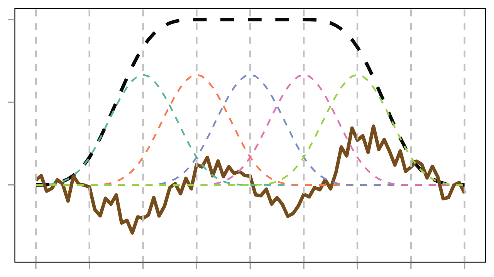

```{r}
#| echo: false
library(tidyverse)
library(mgcv)
library(gratia)
library(MASS)
library(ggtext)
```

```{r}
#| echo: false
theme_set(
  theme_light(base_size = 16, base_family="serif") +
    theme(legend.background = element_rect(fill = "transparent"),
          legend.key = element_rect(fill = "transparent", color = NA),
          panel.grid.minor = element_blank(),
          panel.border = element_rect(color = "black",
                                      linewidth = 0.5,
                                      fill = NA),
          plot.margin = margin(5, 5, 5, 5, unit = "pt")
          )
  )
```
## 你将学到

::: {.incremental style="font-size: 1.2em;"}
- 线性模型中的“线性”究竟指什么？
- 处理“非线性”的基本思路
- 广义加性模型（GAM）的基本思想
- 样条（Splines）与基函数（Basis Functions）
- GAM 如何通过惩罚项防止过拟合
- 在 R 中使用 mgcv 包拟合 GAM
- 模型诊断
:::

# “线性”模型


## 什么是“线性”模型？

::: {.fragment}
下面的是“线性”模型吗？
$$
\begin{align}
&y_i = \beta_0 + \beta_1 x_i + \beta_2x_i^2 + \varepsilon_i \\
&y_i = \beta_0 + \beta_1 log(x_i) + \varepsilon_i \\
&y_i = \beta_0 + \beta_1 x_i w_i + \varepsilon_i \\
&y_i = \beta_0 + \beta_1 \text{exp}(x_i) + \varepsilon_i \\
&y_i = \beta_0 + \beta_1 \text{sin}(x_i) + \varepsilon_i \\
\end{align}
$$
:::

::: {.fragment}
下面这些呢？
$$
\begin{align}
&y_i = \beta_0 + \beta_1 x_i^{\beta_2}  + \varepsilon_i \\
&y_i = \beta_0 + \beta_1 e^{\beta_2x_i} + \varepsilon_i \\
&v_i = \frac{v_{max}s_i}{k_m + s_i} \\
\end{align}
$$
:::

## 什么是“线性”模型？

> ***"The word ‘linear’ in linear regression basically means linear in the parameters."***

$$
\begin{align}
&y_i = \beta_0 + \beta_1 x_i + \beta_2x_i^2 + \varepsilon_i \\
&y_i = \beta_0 + \beta_1 log(x_i) + \varepsilon_i \\
&y_i = \beta_0 + \beta_1 x_i w_i + \varepsilon_i \\
&y_i = \beta_0 + \beta_1 \text{exp}(x_i) + \varepsilon_i \\
&y_i = \beta_0 + \beta_1 \text{sin}(x_i) + \varepsilon_i \\
\end{align}
$$

::: {.fragment}
对于以上的方程，我们都可以定义一个新的自变量，将其转换成我们熟悉的线性模型的形式，比如：
$$
\begin{align}
&y_i = \beta_0 + \beta_1 log(x_i) + \varepsilon_i \\
&z_i = log(x_i) \\
&y_i = \beta_0 + \beta_1 z_i + \varepsilon_i \\
\end{align}
$$
:::

## 分类变量怎么进入“线性”模型？

- 关键仍然是：**对参数是线性的**
- 分类变量本身不能直接做加减乘除，但我们可以把“属于哪一组”写成 0/1 指示变量（indicator / dummy variables）

$$
y_i = \beta_0 + \beta_1 I(x_i = \text{B}) + \varepsilon_i
$$

::: {.fragment}
- 当 $x_i$ 属于基线组 A 时，$I(x_i = \text{B}) = 0$
- 当 $x_i$ 属于组 B 时，$I(x_i = \text{B}) = 1$
- 所以模型依旧是对 $\beta_0, \beta_1$ 线性的
:::

## 二元分类变量：两组均值模型

设 $group_i \in \{\text{control}, \text{treatment}\}$，定义

$$
D_i = I(group_i = \text{treatment})
$$

则

$$
y_i = \beta_0 + \beta_1 D_i + \varepsilon_i
$$

::: {.incremental}
- 当 $D_i = 0$（control）时：$E(y_i) = \beta_0$
- 当 $D_i = 1$（treatment）时：$E(y_i) = \beta_0 + \beta_1$
- 因此 $\beta_1$ 表示 treatment 与 control 的均值差
:::

## 多水平分类变量：$K$ 组只需要 $K - 1$ 个参数

若 `program` 有三组：A、B、C，以 A 为基线组，则可定义

$$
\begin{align}
D_{Bi} &= I(program_i = \text{B}) \\
D_{Ci} &= I(program_i = \text{C})
\end{align}
$$

于是

$$
y_i = \beta_0 + \beta_1 D_{Bi} + \beta_2 D_{Ci} + \varepsilon_i
$$

$$
\mathbf{X} =
\begin{bmatrix}
1 & 0 & 0 \\
1 & 1 & 0 \\
1 & 0 & 1
\end{bmatrix}
$$

::: {.fragment}
- A 组均值：$\beta_0$
- B 组均值：$\beta_0 + \beta_1$
- C 组均值：$\beta_0 + \beta_2$
:::

## R 中如何实现二元分类变量？

```{r}
#| echo: true
binary_demo <- tibble(
  group = factor(c("control", "control", "control", "treatment", "treatment", "treatment"),
                 levels = c("control", "treatment")),
  score = c(72, 75, 74, 80, 83, 85)
)

binary_fit <- lm(score ~ group, data = binary_demo)

model.matrix(binary_fit)
coef(binary_fit)
```

::: {.fragment}
- `(Intercept)` 是 control 组均值
- `grouptreatment` 是 treatment 相对 control 的差值
:::

## R 中如何实现多水平分类变量？

```{r}
#| echo: true
program_demo <- tibble(
  program = factor(c("A", "A", "B", "B", "C", "C"), levels = c("A", "B", "C")),
  score = c(78, 80, 84, 85, 90, 92)
)

program_fit <- lm(score ~ program, data = program_demo)

model.matrix(program_fit)
coef(program_fit)
```

::: {.fragment}
- R 默认使用 treatment contrasts
- 因而这里只会生成 `programB` 和 `programC` 两列
- 基线组 A 被吸收到截距 `(Intercept)` 中
:::

## 对比：不同 contrasts 会改变参数解释

```{r}
#| echo: true
model.matrix(~ program, data = program_demo)

contrasts(program_demo$program) <- contr.sum(3)
model.matrix(~ program, data = program_demo)
```

::: {.incremental}
- treatment contrasts：系数表示“相对基线组”的差异
- sum contrasts：系数表示“相对总体均值”的偏离
- **拟合值不变，但参数解释会变**
:::

## “非线性”的示例
米氏方程（Michaelis-Menten equation）

::: {.panel-tabset}
### 典型图像
```{r}
#| echo: false
#| fig-align: center
tibble(
    s = seq(0, 20, by = 0.1),
    v_max = 60,
    k_m = 2
    ) |>
    mutate(v = v_max * s / (k_m + s) + rnorm(n())) |>
    ggplot(aes(s, v)) +
    geom_point() +
    geom_smooth(method = "lm") +
    annotate("text", x = 5, y = 55, label = latex2exp::TeX(r"($v = \frac{v_{max}s}{k_m + s}$)"), size = 10) +
    labs(x = "Substrate concentration (S)", y = "Reaction velocity (V)")
```
### 线性方程的残差
```{r}
#| echo: false
#| fig-align: center
tibble(
    s = seq(0, 20, by = 0.1),
    v_max = 60,
    k_m = 2
    ) |>
  mutate(v = v_max * s / (k_m + s) + rnorm(n())) |>
  lm(v ~ s, data = _) |>
  plot(which = 1)
  
```
:::

## 如何处理非线性关系？
- 通过转换自变量或响应变量，可以将非线性关系转化为线性关系，例如：

$$
\begin{align}
&v_i = \frac{v_{max}s_i}{k_m + s_i} \\
&\frac{1}{v_i} = \frac{k_m + s_i}{v_{max}s_i} = \frac{k_m}{s_i}\frac{1}{v_{max}} + \frac{1}{v_{max}} \\ 
\end{align}
$$

::: {.fragment}
- 如果知道变量间的关系可以使用什么样的函数进行刻画，那么我们可以直接使用非线性最小二乘法（`nls()`）进行拟合。
:::

## 多项式拟合

::: {.panel-tabset}
### HadCRUT4 全球温度数据[^1]
[^1]: 来源：https://www.metoffice.gov.uk/hadobs/hadcrut4/data/current/series_format.html

```{r}
#| echo: false
gtemp <-
  #read_csv("slides/talk07/data/gtemp.csv") 
  read_csv("data/gtemp.csv")

gtemp |>
  ggplot(aes(x = Year, y = Temperature)) +
  geom_point(alpha = 0.6) +
  geom_line(alpha = 0.4) +
  labs(x = "Year", y = "Temperature annomaly (<sup>o</sup>C)") +
  theme(axis.title.y = element_markdown())
```

### 多项式拟合

```{r}
#| eval: false
gtemp_poly_model <- lm(Temperature ~ poly(Year, degree = 3), data = gtemp)
```

### 多项式拟合曲线
```{r}
#| echo: false
p <- c(1, 3, 8, 15)
N <- 300

newd <- tibble(Year = seq(min(gtemp$Year), max(gtemp$Year), length.out = N))

polyFun <- function(i, data) {
  lm(Temperature ~ poly(Year, degree = i), data = data)
}

mods <- map(p, polyFun, data = gtemp)
preds <- map(mods, predict, newdata = newd) |>
  set_names(p) |>
  as_tibble()

poly_pred <-
  bind_cols(newd, preds) |>
  pivot_longer(-Year, names_to = "Degree", values_to = "Temperature") |>
  mutate(Degree = ordered(Degree, levels = p))

ggplot(gtemp, aes(x = Year, y = Temperature)) +
  geom_line() +
  geom_point() +
  labs(x = 'Year', y = "Temperature anomaly (<sup>o</sup>C)") +
  geom_line(
    data = poly_pred,
    mapping = aes(x = Year, y = Temperature, colour = Degree),
    linewidth = 1.5,
    alpha = 0.9
  ) +
  scale_color_brewer(name = "Degree", palette = "PuOr") +
  theme(legend.position = "right", axis.title.y = element_markdown())
```

:::

## 多项式拟合的缺点

- 多项式拟合可能会导致过拟合，尤其是当多项式的阶数较高时。
- 多项式拟合在数据范围之外的预测可能会非常不准确。

::: {style="zoom: 1"}
```{r}
#| echo: false
#| fig-align: center
#| fig-width: 8
p <- c(1, 3, 8, 15)
N <- 300

newd <- tibble(
  Year = seq(min(gtemp$Year) - 5, max(gtemp$Year) + 5, length.out = N)
)

polyFun <- function(i, data) {
  lm(Temperature ~ poly(Year, degree = i), data = data)
}

mods <- map(p, polyFun, data = gtemp)
preds <- map(mods, predict, newdata = newd) |>
  set_names(p) |>
  as_tibble()

poly_pred <-
  bind_cols(newd, preds) |>
  pivot_longer(-Year, names_to = "Degree", values_to = "Temperature") |>
  mutate(Degree = ordered(Degree, levels = p))

ggplot(gtemp, aes(x = Year, y = Temperature)) +
  geom_line() +
  geom_point() +
  labs(x = 'Year', y = "Temperature anomaly (<sup>o</sup>C)") +
  geom_line(
    data = poly_pred,
    mapping = aes(x = Year, y = Temperature, colour = Degree),
    linewidth = 1.5,
    alpha = 0.9
  ) +
  scale_color_brewer(name = "Degree", palette = "PuOr") +
  theme(
    legend.position = "inside",
    legend.position.inside = c(0.8, 0.2),
    axis.title.y = element_markdown()
  )
```
:::

# 广义加性模型

## `mgcv`包拟合GAM

```{r}
gtemp_gam_m0 <- mgcv::gam(Temperature ~ s(Year), data = gtemp)
```


```{r}
#| echo: false
gtemp_gam_m0_pred <-
  predict(
    gtemp_gam_m0,
    newdata = tibble(
      Year = seq(min(gtemp$Year) - 5, max(gtemp$Year) + 5, length.out = N)
    ),
    se.fit = TRUE
  ) |>
  as_tibble() |>
  mutate(
    Year = seq(min(gtemp$Year) - 5, max(gtemp$Year) + 5, length.out = N),
    upr = fit + 1.96 * se.fit,
    lwr = fit - 1.96 * se.fit
  )


ggplot(gtemp, aes(x = Year, y = Temperature)) +
  geom_point() +
  geom_line(
    data = gtemp_gam_m0_pred,
    mapping = aes(y = fit, x = Year),
    inherit.aes = FALSE,
    linewidth = 1,
    colour = "#025196"
  ) +
  geom_ribbon(
    data = gtemp_gam_m0_pred,
    mapping = aes(ymin = lwr, ymax = upr, x = Year),
    alpha = 0.4,
    inherit.aes = FALSE,
    fill = "#fdb338"
  ) +
  labs(x = 'Year', y = "Temperature anomaly (<sup>o</sup>C)") +
  theme(axis.title.y = element_markdown())
```

## GAM 的基本思想

GAM 可用如下形式表示：
$$
y_i = \beta_0 + f_1(x_{i1}) + f_2(x_{i2}) + \cdots + f_p(x_{ip}) + \varepsilon_i
$$

其中$f_j(.)$是:

- 理论上描述了自变量与响应变量之间关系的未知函数，我们不知道它的具体形式，但假定它应该是一个**平滑函数（smooth function）**。
- 然后，我们用由一组**基函数（basis functions）**线性组合而成的**样条函数（spline function）**来近似这个未知函数：
$$
f_j(x) = \sum_{k=1}^{K_j} \beta_{jk} b_{jk}(x)
$$

## 样条函数与基函数


```{r}
#| echo: false

#' B-Spline Basis Function
#' @param x The value(s) at which to evaluate the basis
#' @param i The index of the basis function (starting at 1)
#' @param k The degree of the spline (3 for Cubic)
#' @param knots A numeric vector of knot locations
b_spline_basis <- function(x, i, k, knots) {
    # Base Case: Degree 0 (Step Function)
    if (k == 0) {
        return(ifelse(x >= knots[i] & x < knots[i + 1], 1, 0))
    }

    # Recursion Step:
    # We need to calculate the "blend" of two lower-degree functions

    # Term 1 weight
    denom1 <- knots[i + k] - knots[i]
    term1 <- 0
    if (denom1 != 0) {
        term1 <- ((x - knots[i]) / denom1) * b_spline_basis(x, i, k - 1, knots)
    }

    # Term 2 weight
    denom2 <- knots[i + k + 1] - knots[i + 1]
    term2 <- 0
    if (denom2 != 0) {
        term2 <- ((knots[i + k + 1] - x) / denom2) * b_spline_basis(x, i + 1, k - 1, knots)
    }

    return(term1 + term2)
}

b_spline_simulate <- 
  tibble(x = seq(0, 10, 0.1)) |>
      mutate(
          b0 = b_spline_basis(x, 1, 3, 0:4),
          b1 = b_spline_basis(x, 1, 3, 1:5),
          b2 = b_spline_basis(x, 1, 3, 2:6),
          b3 = b_spline_basis(x, 1, 3, 3:7),
          b4 = b_spline_basis(x, 1, 3, 4:8),
          b0_weighted = b0*-0.4,
          b1_weighted = b1*0.2,
          b2_weighted = b2*0.1,
          b3_weighted = b3*-0.3,
          b4_weighted = b4*0.5,
          y = b0_weighted + b1_weighted + b2_weighted + b3_weighted + b4_weighted + rnorm(length(x), sd = 0.05),
          y_fitted = b0_weighted + b1_weighted + b2_weighted + b3_weighted + b4_weighted
      )

b_spline_simulate |>
    dplyr::select(-y) |>
    dplyr::select(-ends_with("ed")) |>
    pivot_longer(-x, names_to = "Basis", values_to = "Value") |>
    ggplot(aes(x = x, y = Value, color = Basis)) +
    geom_line(linewidth = 1, linetype = "dashed") +
    geom_vline(xintercept = 0:8, linetype = "dashed", color = "grey80") +
    labs(x = "x", y = "Basis Function Value") +
    scale_x_continuous(breaks = seq(0, 8, by = 1), limits = c(0, 8)) +
    scale_y_continuous(limits = c(-0.4, 0.7)) +
    scale_color_brewer(palette = "Set2") +
    guides(color = "none") +
    theme(
        legend.position = "right",
        panel.grid.major = element_blank(),
        panel.grid.minor = element_blank(),
        axis.title = element_blank(),
        axis.text = element_blank()
    )


``` 

## 样条函数与基函数

```{r}
#| echo: false
f1 <-
    b_spline_simulate |>
    dplyr::select(!ends_with("ed")) |>
    pivot_longer(-x, names_to = "Basis", values_to = "Value") |>

    ggplot(aes(x = x, y = Value, color = Basis, linetype = Basis)) +
    geom_line(linewidth = 1) +
    geom_vline(xintercept = 0:8, linetype = "dashed", color = "grey80") +
    scale_color_manual(values = c("b0" = "#66c2a5", "b1" = "#fc8d62", "b2" = "#8da0cb", "b3" = "#e78ac3", "b4" = "#a6d854", "y" = "#895e23")) +
    scale_linetype_manual(values = c("dashed", "dashed", "dashed", "dashed", "dashed", "solid")) +
    labs(x = "x", y = "Basis Function Value") +
    scale_x_continuous(breaks = seq(0, 8, by = 1), limits = c(0, 8)) +
    scale_y_continuous(limits = c(-0.4, 0.7)) +
    guides(color = "none", linetype = "none") +
    theme(
        legend.position = "right",
        panel.grid.major = element_blank(),
        panel.grid.minor = element_blank(),
        axis.title = element_blank(),
        axis.text = element_blank()
    )

f1
```


## 样条函数与基函数

```{r}
#| echo: false
#| eval: false
b0_weight_pool <- seq(1, -0.4, length.out = 10)
b1_weight_pool <- seq(1, 0.2, length.out = 10)
b2_weight_pool <- seq(1, 0.1, length.out = 10)
b3_weight_pool <- seq(1, -0.3, length.out = 10)
b4_weight_pool <- seq(1, 0.5, length.out = 10)
x <- seq(0, 10, 0.1)
y_observed <-
    b_spline_basis(x, 1, 3, 0:4) * b0_weight_pool[10] + b_spline_basis(x, 1, 3, 1:5) * b1_weight_pool[10] +
    b_spline_basis(x, 1, 3, 2:6) * b2_weight_pool[10] + b_spline_basis(x, 1, 3, 3:7) * b3_weight_pool[10] +
    b_spline_basis(x, 1, 3, 4:8) * b4_weight_pool[10] +
    rnorm(length(x), sd = 0.05)


b_spline_simulate_pool <- vector(mode = "list", length = 10)
for (i in 1:10) {
    b_spline_simulate_i <-
        tibble(x = seq(0, 10, 0.1)) |>
        mutate(
            step = paste0("step_", i),
            b0 = b_spline_basis(x, 1, 3, 0:4) * b0_weight_pool[i],
            b1 = b_spline_basis(x, 1, 3, 1:5) * b1_weight_pool[i],
            b2 = b_spline_basis(x, 1, 3, 2:6) * b2_weight_pool[i],
            b3 = b_spline_basis(x, 1, 3, 3:7) * b3_weight_pool[i],
            b4 = b_spline_basis(x, 1, 3, 4:8) * b4_weight_pool[i],
            y_fitted = b0 + b1 + b2 + b3 + b4,
            y = y_observed
        )
    b_spline_simulate_pool[[i]] <- b_spline_simulate_i
}

library(gganimate)
p <- 
bind_rows(b_spline_simulate_pool) |>
    mutate(step = factor(step, levels = paste0("step_", 1:10))) |>
    ggplot() +
    geom_line(aes(x = x, y = y_fitted), color = "#090a0b", linewidth = 1, linetype = "dashed") +
    geom_line(aes(x = x, y = y), color = "#895e23", linewidth = 1) +
    geom_line(aes(x, b0), color = "#66c2a5", linetype = "dashed") +
    geom_line(aes(x, b1), color = "#fc8d62", linetype = "dashed") +
    geom_line(aes(x, b2), color = "#8da0cb", linetype = "dashed") +
    geom_line(aes(x, b3), color = "#e78ac3", linetype = "dashed") +
    geom_line(aes(x, b4), color = "#a6d854", linetype = "dashed") +
    geom_vline(xintercept = 0:8, linetype = "dashed", color = "grey80") +
    scale_x_continuous(breaks = seq(0, 8, by = 1), limits = c(0, 8)) +
    scale_y_continuous(limits = c(-0.4, NA)) +
    theme(
        legend.position = "right",
        panel.grid.major = element_blank(),
        panel.grid.minor = element_blank(),
        axis.title = element_blank(),
        axis.text = element_blank()
    ) +
    transition_states(step,
        transition_length = 1,
        state_length = 0,
        wrap = FALSE
    ) +
    ease_aes('linear')
p_anim <- animate(p, nframes = 100, fps = 20, start_pause = 20, end_pause = 30, res = 300, width = 1400, height = 720, renderer = gifski_renderer())
anim_save("slides/talk07/images/b_spline_animation.gif", animation = p_anim)
```




## 样条函数与基函数
```{r}
#| echo: false
f2 <- 
    b_spline_simulate |>
    dplyr::select(!c(b0, b1, b2, b3, b4)) |>
    pivot_longer(-x, names_to = "Basis", values_to = "Value") |>

    ggplot(aes(x = x, y = Value, color = Basis, linetype = Basis)) +
    geom_line(linewidth = 1) +
    geom_vline(xintercept = 0:8, linetype = "dashed", color = "grey80") +
    labs(x = "x", y = "Basis Function Value") +
    scale_x_continuous(breaks = seq(0, 8, by = 1), limits = c(0, 8)) +
    scale_y_continuous(limits = c(-0.4, 0.7)) +
    scale_color_manual(values = c("b0_weighted" = "#66c2a5", "b1_weighted" = "#fc8d62", "b2_weighted" = "#8da0cb", "b3_weighted" = "#e78ac3", "b4_weighted" = "#a6d854", "y_fitted" = "#090a0b", "y" = "#895e23")) +
    guides(color = "none", linetype = "none") +
    scale_linetype_manual(values = c("dashed", "dashed", "dashed", "dashed", "dashed", "solid", "dashed")) +
    theme(
        legend.position = "right",
        panel.grid.major = element_blank(),
        panel.grid.minor = element_blank(),
        axis.title = element_blank(),
        axis.text = element_blank()
    )
f2
```

## 三次B样条函数（Cubic B-splines）

::: {.panel-tabset}

### 特点
三次B样条函数是一种常用的样条函数，其基函数具有以下特点：

- 由三次多项式片段组成，每个片段在两个相邻的节点（knots）之间定义。
- 基函数影响范围有限，为相邻5个节点内的区间提供非零值，这使得它们具有局部支持（local support）的性质。
- 在节点处具有连续的一阶和二阶导数，确保了函数的平滑性。
- 可以通过调整节点的位置和数量来控制函数的灵活性和拟合能力。

### 典型图像
```{r}
#| echo: false
b_spline_simulate |>
    dplyr::select(-y) |>
    dplyr::select(-ends_with("ed")) |>
    ggplot(aes(x = x, y = b1)) +
    geom_line(linewidth = 1, linetype = "dashed") +
    geom_vline(xintercept = 0:6, linetype = "dashed", color = "grey80") +
    # shadow between 1 and 5 , the whole space, not just sapce between the curve and x-axis
    geom_ribbon(data = subset(b_spline_simulate, x >= 1 & x <= 5), aes(ymin = 0, ymax = 0.7), fill = "#fc8d62", alpha = 0.4) +
    scale_x_continuous(breaks = seq(0, 6, by = 1), limits = c(0, 6))+
    theme(
        legend.position = "right",
        panel.grid.major = element_blank(),
        panel.grid.minor = element_blank(),
        axis.title = element_blank(),
        axis.text = element_blank()
    )
```

:::

## 过拟合 vs. 欠拟合

```{r}
#| echo: false
K <- 40
lambda <- c(10000, 1, 0.01, 0.00001)
N <- 300
newd <- tibble(Year = seq(min(gtemp$Year), max(gtemp$Year), length.out = N))

fits <- map(lambda, function(lambda, data) gam(Temperature ~ s(Year, k = K, sp = lambda), data = data), data = gtemp)

pred <-
    map(fits, predict, newdata = newd) |>
    set_names(lambda) |>
    bind_cols() |>
    bind_cols(newd) |>
    pivot_longer(-Year, names_to = "Lambda", values_to = "Fitted") |>
    mutate(Lambda = ordered(Lambda, levels = lambda, labels = paste("&lambda; =", as.character(lambda))))


ggplot() +
    geom_point(data = gtemp, mapping = aes(x = Year, y = Temperature), alpha = 0.6) +
    geom_line(
        data = pred, mapping = aes(x = Year, y = Fitted, group = Lambda),
        size = 1, colour = "#e66101"
    ) +
    facet_wrap(~Lambda, ncol = 2) +
    labs(x = "Year", y = "Temperature anomaly (<sup>o</sup>C)") +
    theme(
        strip.text = element_markdown(size = 12),
        axis.title.y = element_markdown()
    )
```

## wiggliness vs. smooth

GAM 在拟合的过程中引入了一个惩罚项（penalty term）来控制函数的wiggliness（即函数的弯曲程度）：
$$
\text{Penalized Loss} = \text{Fitting Loss} + \lambda \int (f''(x))^2 dx
$$  
wiggliness是通过函数的二阶导数来衡量的。函数越wiggly，二阶导数的值就越大。

- 当惩罚参数（lambda）较大时，模型会倾向于拟合一个更平滑的函数；
- 当惩罚参数较小时，模型可能会拟合一个更wiggly的函数。

## `mgcv`包与惩罚参数的选择
`mgcv`包会通过一定方法，来自动选择最优的惩罚参数，从而在拟合数据和控制函数复杂度之间找到一个平衡点。


```{r}
gtemp_gam_m1 <- gam(Temperature ~ s(Year), data = gtemp, method = "REML") 
# 默认的method是GCV.Cp，REML通常更稳定。
```
通过以下方式可以看到选择的惩罚参数：
```{r}
gtemp_gam_m1$sp
```

## `gam()`模型结果解读
::: {.panel-tabset}

### 模型`summary()`
```{r}
#| echo: false
summary(gtemp_gam_m1) 
```

### edf
edf（effective degrees of freedom）是一个衡量平滑函数复杂度的指标。edf越大，函数越wiggly；edf越小，函数越平滑。

- edf = 1时，函数是一条直线，惩罚想抑制了所有的wiggliness。
- edf = 2时，函数的关系大致是二次的（一个简单的U形或倒U形）。
- edf > 2时，函数呈现非线性，且数值越高越复杂。

### p值

p值用于检验平滑函数是否显著不同于零函数（即没有关系）。如果p值小于某个显著性水平（如0.05），我们可以拒绝零函数的假设。

预计作业：用实例说明，零函数究竟是下列哪种情况：

1. 一条直线，可能斜率不为零。
2. 一条水平线

:::

## `gam()`模型结果解读

::: {.panel-tabset}

### `plot()`
`plot()`函数可以用来可视化平滑函数的拟合结果，包括拟合曲线、置信区间以及残差分布等信息（用`?plot.gam`查看帮助文档）。

### 图像
```{r}
plot(gtemp_gam_m1, shade = TRUE)
```

:::

## 模型检验
`gam.check()`函数可以用来检验GAM模型的拟合情况，包括残差的分布、拟合值与残差的关系等。

::: {.panel-tabset}
### 图像
```{r}
#| echo: false
text_output <- capture.output(gam.check(gtemp_gam_m1))
```

### 输出文本
```{r}
#| echo: false
cat(text_output, sep = "\n") 
```

### p值
这里的p值对应的零假设（Null hypothesis）是：

- H0: 残差是随机分布的，没有系统性的模式。
- H1: 残差存在系统性的模式，可能表明模型拟合不充分或者存在某些未捕捉到的结构。

当出现p值非常小（如 < 0.05），同时edf接近于 k' （k-1，即基函数的数量减去1）时，可能表明模型欠拟合了数据，或者说模型过于简单，无法捕捉数据中的复杂关系，需要增加 k 的值来增加模型的灵活性。

:::

## k 的设定

k 值：
- k 是基函数的维数（数量）。
- 通过 `s()` 函数中的 `k` 参数来指定。
- k 的默认值在单变量平滑器中通常是 10。

将k值设置为20，看看模型检验的结果：
```{r}
gtemp_gam_m2 <- gam(Temperature ~ s(Year, k = 20), data = gtemp, method = "REML")
```
这里使用了`k.check()`函数来检查k值的情况：
```{r}
k.check(gtemp_gam_m2)
```

此时虽然p 值仍较低，但是 edf 明显小于 k’了，这表明模型已经足够灵活，如果残差中仍残留有明显模式，和 k 值的选择无关了。

## ISIT 数据集
ISIT 数据集[^2]记录了不同站位荧光强度的垂直剖面：

[^2]: 来源：Mixed effects models and extensions in ecology with R, Zuur et al. 2009.

```{r}
#｜ echo: false
ISIT <- 
  read_table("data/ISIT.txt") %>%
  mutate(across(c(Station, Month,Year, Season), factor))
```
::: {.panel-tabset}

### `print()`
```{r}
ISIT
```

### `glimpse()`

```{r}
glimpse(ISIT)
```

:::

## 不同站位的垂直剖面
```{r}
#| echo: false
ISIT_station_1289 <-
    ISIT |>
    filter(Station %in% c("1", "2", "8", "9"))

ISIT_station_1289 |>
    ggplot() +
    geom_point(aes(Sources, SampleDepth)) +
    scale_y_reverse(limits = c(5000, NA)) +
    facet_wrap(~Station) +
    xlab("Depth (m)")
```

## GAM 拟合 ISIT 数据

这里通过 `by` 参数来为不同的站位拟合不同的平滑函数：
```{r}
ISIT_gam_m0 <- gam(SampleDepth ~ s(Sources, by = Station), data = ISIT_station_1289, method = "REML")
```

作业：

1. 使用 `summary()`，`plot()` 和 `gam.check()` 来解读模型结果。 
2. 以上模型与下面模型有何区别。
3. `ISIT_gam_m0`是否需要优化，如何优化？

```{r}
ISIT_gam_m1 <- gam(SampleDepth ~ Station + s(Sources, by = Station), data = ISIT_station_1289, method = "REML")
``` 
