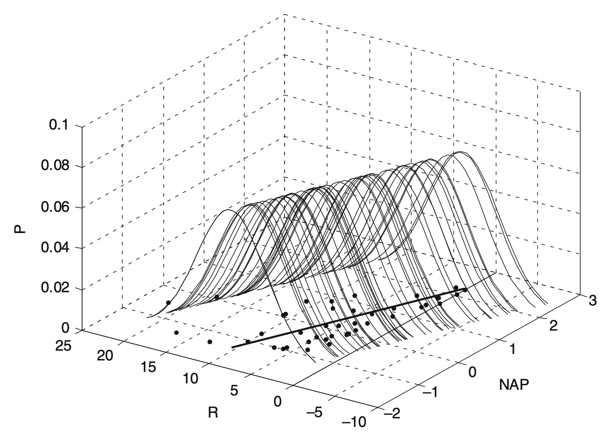
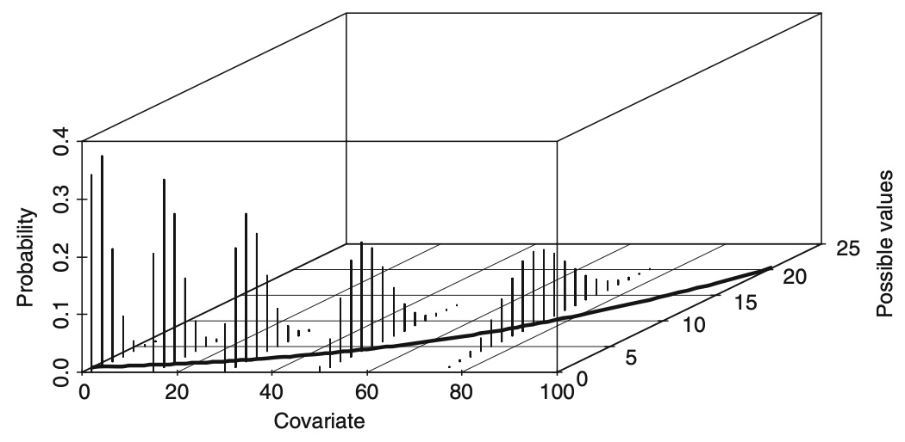

```{r}
#| echo: false
library(tidyverse)
library(patchwork)
library(MASS)
library(showtext)
font_add("PingFang SC", regular = "/System/Library/AssetsV2/com_apple_MobileAsset_Font8/86ba2c91f017a3749571a82f2c6d890ac7ffb2fb.asset/AssetData/PingFang.ttc")
font_add("TNR", regular = "/System/Library/Fonts/Supplemental/Times New Roman.ttf")
showtext_auto()
```

```{r}
#| echo: false
theme_set(
  theme_light(base_size = 16, base_family = "PingFang SC") +
    theme(
      legend.background = element_rect(fill = "transparent"),
      legend.key = element_rect(fill = "transparent", color = NA),
      panel.grid.minor = element_blank(),
      panel.border = element_rect(color = "black", linewidth = 0.5, fill = NA),
      plot.margin = margin(5, 5, 5, 5, unit = "pt")
    )
)
```

```{r}
#| echo: false
#| include: false

# --- Sparrows data ---
Sparrows <- read_table("data/Sparrows.txt")

# --- RoadKills data ---
RoadKills <- read_table("data/RoadKills.txt")

# --- Lice data ---
Lice <- read_table("data/Lice.txt")
```

## 你将学到

::: incremental

- 指数分布族（Exponential family）：正态、泊松、二项分布
- 广义线性模型（GLM）：构建步骤、MLE、离差（Deviance）
- 泊松 GLM：模型拟合、选择与假设检验
- 过度离散（Overdispersion）：检测与准泊松模型
- 负二项分布 GLM：理论、拟合与诊断
- GAM 中的偏移项（offset）：处理采样体积不等

:::

# 指数分布族（Exponential family）

## 响应变量的数据类型

响应变量（Response variable）并不总是连续型随机变量且服从正态分布。

- 存在性数据（Presence/absence data）：1 和 0
- Proportional data（比例数据）：0—100%
- 计数数据（count data）：非负整数
- 持续时间或类似的数据：非负连续变量

## 正态分布（Normal distribution）

```{r}
#| echo: false
panel_A <-
  Sparrows |>
  ggplot() + geom_histogram(aes(wt), bins = 15, fill = "transparent", color = "black") +
  xlab("Weight") +
  labs(title = "Observed data")

panel_B <-
  Sparrows |>
  ggplot() + geom_histogram(aes(x = wt, y = after_stat(density)), bins = 15, fill = "transparent", color = "black") +
  xlab("Weight") +
  labs(title = "Observed data")

panel_C <-
  tibble(wt_simu = rnorm(1281, mean = mean(Sparrows$wt), sd = sd(Sparrows$wt))) |>
  ggplot() +
  geom_histogram(aes(x = wt_simu), bins = 15, fill = "transparent", color = "black") +
  xlab("Weight") +
  labs(title = "Simulated data")

panel_D <-
  tibble(Weight = seq(0, 30, length = 200),
         Probabilites = dnorm(seq(0, 30, length = 200), mean = mean(Sparrows$wt), sd = sd(Sparrows$wt))) |>
  ggplot() +
  geom_line(aes(x = Weight, y = Probabilites)) +
  labs(title = "Normal density curve")

(panel_A | panel_B) / (panel_C + panel_D)
```

## 正态分布（Normal distribution）

概率密度函数（probability density function, pdf）:

$$
f(y_i; \mu, \sigma) = \frac{1}{\sigma\sqrt{2\pi}} e^{-\frac{(y_i - \mu)^2}{2\sigma^2}}
$$

期望和方差：

$$
E(Y) = \mu\\
var(Y) = \sigma^2
$$

## 线性回归的正态分布假设

::: {style="text-align: center;"}
{width="70%"}
:::

## 泊松分布（The Poisson Distribution）

柏松分布是一种离散概率分布，用于描述在固定时间间隔内，某事件发生特定次数的概率。还可以推广到其它类型的空间，如空间区间，给定面积或体积内事件发生次数。典型实例：

1. 客服每小时接到的电话数
2. 放射性物质单位时间内的衰变次数

在泊松分布中，若某区间内事件发生的期望值为 $\lambda$，则在该区间内恰好发生 k 次事件的概率为：

$$
\frac{\lambda^k e^{-\lambda}}{k!}
$$

::: {style="background-color: #ffff99; padding: 10px; border-radius: 5px;"}
期望和方差都为：$\lambda$
:::

## 柏松分布

```{r}
#| echo: false
#| fig-align: center
poisson_demo_plot <- function(.x) {
  df <- tibble(x = seq(from = 0, to = 2*.x), y = dpois(x, lambda = .x))
  title_x <- paste0("Posison with mean ", .x)
  fig <-
    df |>
      ggplot() +
      geom_linerange(aes(x = x, y = y, ymin = 0, ymax = y)) +
      ylab("Probabilities") +
      labs(title = title_x) +
      scale_x_continuous(breaks = floor(seq(0, max(df$x), length = 10))) +
      theme(axis.title.x = element_blank())
  return(fig)
}
```

```{r}
#| echo: false
#| fig-align: center
mu <- c(3, 5, 10, 100)
fig_list <-
  map(mu, poisson_demo_plot)

(fig_list[[1]] | fig_list[[2]]) / (fig_list[[3]] | fig_list[[4]])
```

::: {style="background-color: #ffff99; padding: 10px; border-radius: 5px;"}
> 柏松分布与二项分布、指数分布、正态分布、伽马分布、负二项分布等有什么关联？
:::

## 二项分布（The Binomial Distribution）

二项分布是一种离散概率分布，描述在进行独立随机试验时，每次试验都有相同概率"成功"的情况下，获得成功的总次数。

例如：掷硬币十次出现五次正面的概率、产品合格率 99% 时抽出 100 件样本全部合格的概率等等。

若进行 n 次实验，单次"成功"的概率为 p，那么总共"成功" k 次的概率为：

$$
Pr(X = k) = \binom{n}{k}p^k(1-p)^{n-k} \; (k = 0,1,\dots,n)
$$

期望和方差为：$np$ 和 $np(1-p)$

## 二项分布（The Binomial Distribution）

```{r}
#| echo: false
binomial_demo_plot <- function(.x) {
  p <- .x$p
  n <- .x$n
  df <- tibble(x = seq(from = 0, to = n), y = dbinom(x, size = n, prob = p))
  title_x <- paste0("p = ", p, ", n = ", n)
  fig <-
    df |>
      ggplot() +
      geom_linerange(aes(x = x, y = y, ymin = 0, ymax = y)) +
      ylab("Probabilities") +
      labs(title = title_x) +
      scale_x_continuous(breaks = floor(seq(0, n, length = 10))) +
      theme(axis.title.x = element_blank())
  return(fig)
}
```

```{r}
#| echo: false
p_n <-
  tibble(n = c(10, 10, 20, 20, 100, 100), p = c(0.2, 0.5, 0.2, 0.5, 0.2, 0.5)) |>
  rowwise() |>
  group_split()
fig_list <-
  map(p_n, binomial_demo_plot)
(fig_list[[1]] | fig_list[[3]] | fig_list[[5]]) / (fig_list[[2]] | fig_list[[4]] | fig_list[[6]])
```

## 什么是指数分布族（Exponential family）？

指数分布族是一类具有特定形式的参数化概率分布集合。这种特殊形式的设定主要基于以下优势：

1. 数学便利性
   - 可通过微分运算直接计算期望、协方差等统计量
   - 具有一系列实用的代数性质

2. 通用性
   - 在数学意义上是最自然的概率分布集合之一
   - 包含众多常见分布（如正态分布、泊松分布等）

该分布类有时也被称为：指数类（exponential class）, Koopman–Darmois 族（历史名称）。需注意的是，虽然常被简称为"指数族"，但其核心特征在于所有成员分布均具备一系列优良特性，其中最重要的是充分统计量（sufficient statistic）的存在性。

# 广义线性模型（generalized linear regression, GLM）

## GLM 的构建

广义线性模型（GLM）的构建包含以下三个核心步骤：

1. 响应变量分布假设  
   设定响应变量 $Y$ 的概率分布形式（指数分布族），该分布同时决定了 $Y$ 的均值与方差特性。

2. 解释变量的线性组合（linear predictor）：

$$
\eta = X\beta
$$

3. 连接函数（link function）$g$：

$$
g(E(Y|X)) = g(\mu) = \eta
$$

## 采用正态分布和恒等连接函数的 GLM

一般线性回归模型就是采用正态分布和恒等连接函数的 GLM：

$$
Y_i \sim N(\mu_i, \sigma^2)\\
E(Y_i) = \mu_i, \; var(Y_i) = \sigma^2\\
\mu_i = X_i\beta
$$

## 柏松 GLM

$$
Y_i \sim P(\lambda_i)\\
E(Y_i) = \lambda_i, \; var(Y_i) = \lambda_i\\
log(\lambda_i) = X_i\beta \text{ or } \lambda_i = e^{X_i\beta}
$$

这里连接函数为对数函数。

## 柏松 GLM

$$
\lambda_i = exp(0.01 + 0.03\times x_i)
$$

```{r}
#| echo: false
#| fig-align: center
tibble(x = 1:100, eta = 0.01+0.03*x, lamb = exp(eta)) |>
  rowwise() |>
  mutate(y = rpois(1, lamb)) |>
  ggplot() +
  geom_point(aes(x, y), shape = 1) +
  geom_line(aes(x, lamb))
```

## 柏松 GLM

$$
\lambda_i = exp(0.01 + 0.03\times x_i)
$$

::: {style="text-align: center;"}
{width="90%"}
:::

## 柏松 GLM：实例

RoadKills 数据集

```{r}
#| echo: false
RoadKills |>
  ggplot() +
  geom_point(aes(D.PARK, TOT.N), shape = 1) +
  ylab("Road kills") +
  xlab("Distance to park")
```

## `glm()` 函数

```{r}
RK_glm_m0 <-
  glm(TOT.N ~ D.PARK, family = poisson, data = RoadKills)
# ?family
```

```{r}
#| echo: false
text_output <- capture.output(summary(RK_glm_m0))
text_output[str_length(text_output) > 0] |>
  cat(sep = "\n")
```

## 最大似然估计（maximum likelihood estimation）和离差（Deviance）

给定一个概率分布 $D$，已知其 $pdf$（连续分布）或 $pmf$（离散分布）为 $f_D$，

以及一个分布参数 $\theta$，

从该分布中抽出一个具有 $n$ 个值的采样 $X_1, X_2,\dots, X_n$，利用 $f_D$ 计算出其 ***似然函数***：

$$
L(\theta|x_1,\dots,x_n) = f_{\theta}(x_1, \dots, x_n)
$$

若 $D$ 是离散分布，$f_\theta$ 是在参数为 $\theta$ 时观测到这一采样的概率；  
若是连续分布，$f_\theta$ 则为 $X_1, X_2,\dots,X_n$ 联合分布的概率密度函数在观测处的取值。

***最大似然估计*** 会在所有可能的 $\theta$ 取值中，寻找一个值使这个采样的"可能性"最大，即似然函数取到最大值。

## 最大似然估计（maximum likelihood estimation）和离差（Deviance）

在柏松 GLM 中：

$$
L(\lambda|y_1,\dots,y_n) = \prod_i^n\frac{\lambda_i^{y_i}e^{-\lambda_i}}{y_i!}
$$

对两侧取对数：

$$
\begin{align}
log(L) &= \sum_i^n(log(\lambda_i^{y_i}e^{-\lambda_i}) - log(y_i!)) \\
&=\sum_i^n(log(\lambda_i^{y_i}) +log(e^{-\lambda_i}) - log(y_i!))
\end{align}
$$

## 最大似然估计（maximum likelihood estimation）和离差（Deviance）

$$
\begin{align}
log(L) &= \sum_i^n(log(\lambda_i^{y_i}e^{-\lambda_i}) - log(y_i!)) \\
&=\sum_i^n(log(\lambda_i^{y_i}) +log(e^{-\lambda_i}) - log(y_i!)) \\
&=\sum_i^n(y_i\;log(\lambda_i) - \lambda_i - log(y_i!)) \\
&=\sum_i^n(y_i\;X_i\beta - e^{X_i\beta} - log(y_i!))
\end{align}
$$

## 最大似然估计（maximum likelihood estimation）和离差（Deviance）

**零模型离差（Null Deviance）**：  
饱和模型与仅包含截距项（无自变量）的基准模型的对数似然之差的 2 倍：

$$
D_{null} = 2(log(L_{sat}) - log(L_{null}))
$$

其中，饱和模型对数似然：

$$
L(y_1,\dots,y_n|y_1,\dots,y_n) = \prod_i^n\frac{y_i^{y_i}e^{-y_i}}{y_i!}
$$

另：

$$
L(\overline{y},\dots,\overline{y}|y_1,\dots,y_n) = \prod_i^n\frac{\overline{y}^{y_i}e^{-\overline{y}}}{y_i!}
$$

## 最大似然估计（maximum likelihood estimation）和离差（Deviance）

**残差离差（Residual Deviance）**：  
饱和模型与当前模型的对数似然之差的 2 倍：

$$
D_{res} = 2(log(L_{sat}) - log(L_{model}))
$$

::: {style="background-color: #ffff99; padding: 10px; border-radius: 5px;"}
零模型离差，衡量数据原始变异程度，类似于线性回归中的总平方和（TSS）；

残差离差，衡量模型未解释的变异，评估拟合不足的程度，类似于线性回归的残差平方和（RSS）
:::

GLM 不提供 $R^2$，类似的概念是 explained deviance：

$$
\frac{null\;deviance - residual\;deviance}{null\;deviance} \times 100\%
$$

## `predict.glm()` 函数

```{r}
#| eval: false
RoadKills_pred <-
  predict(RK_glm_m0, type = "link", se.fit = T)

RoadKills |>
  mutate(pred = RoadKills_pred$fit,
         se = RoadKills_pred$se.fit) |>
  ggplot() +
  geom_point(aes(D.PARK, TOT.N), shape = 1) +
  geom_line(aes(D.PARK, exp(pred))) +
  geom_ribbon(aes(x = D.PARK, y = exp(pred),
                  ymin = exp(pred - 1.96*se),
                  ymax = exp(pred + 1.96*se)),
              alpha = 0.3) +
  ylab("Road kills") +
  xlab("Distance to park")
```

## `predict.glm()` 函数

```{r}
#| echo: false
RoadKills_pred <-
  predict(RK_glm_m0, type = "link", se.fit = T)

RoadKills |>
  mutate(pred = RoadKills_pred$fit,
         se = RoadKills_pred$se.fit) |>
  ggplot() +
  geom_point(aes(D.PARK, TOT.N), shape = 1) +
  geom_line(aes(D.PARK, exp(pred))) +
  geom_ribbon(aes(x = D.PARK, y = exp(pred),
                  ymin = exp(pred - 1.96*se),
                  ymax = exp(pred + 1.96*se)),
              alpha = 0.3) +
  ylab("Road kills") +
  xlab("Distance to park")
```

## 模型选择与假设检验

`RoadKills` 数据集

```{r}
#| echo: false
RoadKills
```

## 模型选择与假设检验

```{r}
RK_trans <-
  RoadKills |>
  mutate(across(c(POLIC, WAT.RES, URBAN, OLIVE, L.P.ROAD, SHRUB, D.WAT.COUR), sqrt))
```

更复杂的模型：

```{r}
RK_glm_m1 <-
  glm(TOT.N ~ OPEN.L + MONT.S + POLIC + D.PARK + SHRUB + WAT.RES + L.WAT.C +
        L.P.ROAD + D.WAT.COUR, family = poisson, data = RK_trans)
```

## 模型选择与假设检验

```{r}
#| echo: false
text_output <- capture.output(summary(RK_glm_m1))
text_output[c(8:18, 22, 24:26, 28)] |>
  cat(sep = "\n")
```

## `drop1()` 函数

```{r}
drop1(RK_glm_m1, test = "Chi")
```

## `anova()` 函数比较两个嵌套模型

```{r}
RK_glm_m2 <-
  glm(TOT.N ~ MONT.S + POLIC + D.PARK + SHRUB + WAT.RES + L.WAT.C +
        L.P.ROAD + D.WAT.COUR, family = poisson, data = RK_trans)

anova(RK_glm_m1, RK_glm_m2)
```

# 过度离散（Overdispersion）

## 过度离散

过度离散指方差大于期望。常用的判别方法：

1. 残差离差（Residual Deviance, $D$）与自由度（$n-p$）比值：

$$
\frac{D}{n-p}
$$

该值如果大于 1，可能存在过度离散。

2. Pearson 卡方统计量与自由度的比值，若显著大于 1（超过 1.5 或 2），则存在过度离散。Pearson 残差平方和：

$$
X^2 = \sum_{i=1}^n\frac{(y_i-\widehat{\lambda}_i)^2}{\widehat{\lambda}_i}
$$

## 过度离散

3. 若 Pearson 残差随拟合值增加存在系统性增大趋势，提示过度离散。

```{r}
#| out-width: "60%"
#| fig-align: center
plot(RK_glm_m2, which = 1)
```

## 过度离散的原因和解决方法

具体可能原因参见 *Mixed Effects Models and Extensions in Ecology with R*, 224 页。

快速解决方法：准柏松模型（quasi-Poisson model）。与柏松模型不同点在于：

$$
var(Y_i) = \phi\lambda_i
$$

如果 $\phi>1$，即过度离散；如果 $\phi<1$，则是欠离散。

## 拟合准柏松模型

```{r}
RK_glm_m3 <- glm(TOT.N ~ MONT.S + POLIC + D.PARK + SHRUB + WAT.RES + L.WAT.C +
                   L.P.ROAD + D.WAT.COUR, family = quasipoisson, data = RK_trans)
```

```{r}
#| echo: false
text_output <- capture.output(summary(RK_glm_m3))
text_output[c(7:16, 20, 22:24, 26)] |>
  cat(sep = "\n")
```

## 准柏松模型的模型选择

```{r}
drop1(RK_glm_m3, test = "F")
```

去掉最不显著的后，重新拟合模型，重复操作，直至保留的皆显著。

## 准柏松模型的模型选择

最终的模型为：

```{r}
RK_glm_m4 <- glm(TOT.N ~ D.PARK, family = quasipoisson, data = RK_trans)
```

```{r}
#| echo: false
text_output <- capture.output(summary(RK_glm_m4))
text_output[c(5:10, 12, 14:16, 18)] |>
  cat(sep = "\n")
```

## 柏松模型的诊断

Pearson 残差：

$$
\widehat{\varepsilon_i}^p = \frac{y_i - \widehat{\lambda_i}}{\sqrt{var(Y_i)}}
$$

离差残差（deviance residuals）：

$$
\widehat{\varepsilon_i}^D = sign(y_i-\lambda_i)\sqrt{d_i}
$$

$d_i$ 是第 $i$ 个观测的所贡献的离差。

对于柏松模型的诊断，Pearson 残差和离差残差差异不大；对于其它 GLM 的诊断，可能离差残差更合适。

## 柏松模型的诊断

```{r}
#| eval: false
plot(RK_glm_m4)
```

```{r}
#| echo: false
#| fig-width: 8
#| fig-height: 8
#| fig-align: center
par(mfrow = c(2, 2))
plot(RK_glm_m4, which = 1)
plot(RK_glm_m4, which = 2)
plot(RK_glm_m4, which = 3)
plot(RK_glm_m4, which = 5)
```

# 负二项分布 GLM

## 负二项分布

如果 $\phi$ 大于 15 或者 20，准柏松模型也不合适，需要考虑其他模型，比如负二项分布 GLM。

***负二项分布*** 描述在一系列独立同分布的伯努利试验（成功概率为 p）中，成功次数达到指定次数（记为 r）时失败次数（X）的离散概率分布：

$$
X \sim \text{NB}(r, p)
$$

其 pmf 为：

$$
f(k; r,p) \equiv \text{Pr}(X = k) = \binom{k+r-1}{k}(1-p)^k p^r
$$

期望和方差：

$$
E(Y) = \frac{r(1-p)}{p} = \mu, \;\;var(Y) = \frac{r(1-p)}{p^2} = \mu + \frac{\mu^2}{r}
$$

## 负二项分布

```{r}
#| echo: false
NB_demo_plot <- function(.x) {
  mu <- .x$mu
  r <- .x$r
  ymax <- .x$ymax
  df <- tibble(x = seq(from = 0, to = ymax), y = dnbinom(x, size = r, mu = mu))
  title_x <- paste0("NB (", mu, ", ", r, ")")
  fig <-
    df |>
      ggplot() +
      geom_linerange(aes(x = x, y = y, ymin = 0, ymax = y)) +
      ylab("Probabilities") +
      labs(title = title_x) +
      scale_x_continuous(breaks = floor(seq(0, max(df$x), length = 5))) +
      theme(axis.title.x = element_blank(),
            title = element_text(size = 10))
  return(fig)
}
```

```{r}
#| echo: false
#| out-width: "90%"
NB_paras <-
  tibble(mu = c(10, 10, 10, 100, 100, 100),
         r = c(0.1, 1, 1e5, 0.1, 1, 1e5),
         ymax = c(20, 20, 20, 200, 200, 200)) |>
  rowwise() |>
  group_split()

fig_list <-
  map(NB_paras, NB_demo_plot)

(fig_list[[1]] | fig_list[[2]] | fig_list[[3]]) / (fig_list[[4]] | fig_list[[5]] | fig_list[[6]])
```

## 负二项分布 GLM

::: {style="background-color: #ffff99; padding: 10px; border-radius: 5px;"}
"If you are going to apply the negative binomial GLM, then this book (Negative binomial regression by JOSEPH M. HILBE) is a 'must read'."
:::

确认 GLM 的三个关键步骤：

$$
Y_i \sim \text{NB}(\mu, k)\\
E(Y_i) = \mu_i, \; var(Y_i) = \mu_i + \frac{\mu_i^2}{k}\\
log(\mu_i) = X_i\beta \text{ or } \mu_i = e^{X_i\beta}
$$

## 拟合负二项分布 GLM

```{r}
RK_glm_m5 <- glm.nb(TOT.N ~ OPEN.L + MONT.S + POLIC + D.PARK + SHRUB +
                      WAT.RES + L.WAT.C + L.P.ROAD + D.WAT.COUR,
                    link = "log", data = RK_trans)
```

## 拟合负二项分布 GLM

```{r}
#| echo: false
text_output <- capture.output(summary(RK_glm_m5))
text_output[c(8:18, 24:26, 31, 32, 34)] |>
  cat(sep = "\n")
```

## 拟合负二项分布 GLM

```{r}
RK_glm_m6 <-
  glm.nb(TOT.N ~ OPEN.L + D.PARK + L.WAT.C, link = "log", data = RK_trans)
```

```{r}
#| echo: false
text_output <- capture.output(summary(RK_glm_m6))
text_output[c(8:11, 15, 17:18, 24, 25, 27)] |>
  cat(sep = "\n")
```

## 模型验证

```{r}
#| echo: false
#| fig-width: 8
#| fig-height: 8
#| fig-align: center
par(mfrow = c(2, 2))
plot(RK_glm_m6, which = 1)
plot(RK_glm_m6, which = 2)
plot(RK_glm_m6, which = 3)
plot(RK_glm_m6, which = 5)
```

# GAM

## `Lice` 数据集

::: {.panel-tabset}

### 数据表

```{r}
head(Lice, n = 5)
```

### 时序图

```{r}
#| echo: false
#| fig-align: center
Lice |>
  pivot_longer(c(Copepod, Nauplii), names_to = "stage", values_to = "abundance") |>
  unite("Sampling_time", Year, Month, Day, sep = "-") |>
  mutate(Sampling_time = ymd(Sampling_time)) |>
  ggplot() +
    geom_point(aes(Sampling_time, abundance, color = stage)) +
    facet_wrap(~Station, scale = "free") +
    theme(legend.title = element_blank(),
          legend.position = "top",
          axis.title.x = element_blank())
```

:::

## 采样体积问题

这个研究中，每次采样的体积是不同的，如何解决这个问题？

## 采样体积问题：`offset`

$$
E(Y_i) = \mu_i V_i \\
log(E(Y_i)) = log(\mu_i) + log(V_i) = \alpha + \beta X_{i1} + f(X_{2i}) + log(V_i)
$$

```{r}
Lice_clean <-
  Lice |>
  mutate(LVol = log(Volume),
         fStation = factor(Station),
         fDepth = factor(Depth))
Lice_glm_m0 <-
  glm(Copepod ~ fStation + offset(LVol), family = poisson, data = Lice_clean)
```

```{r}
#| echo: false
text_output <- capture.output(summary(Lice_glm_m0))
text_output[str_length(text_output) > 0] |>
  cat(sep = "\n")
```

# 学习资料

- Chapter 8, Mixed Effects Models and Extensions in Ecology with R
- Chapter 9, Mixed Effects Models and Extensions in Ecology with R
- JOSEPH M. HILBE, Negative binomial regression, 2011
